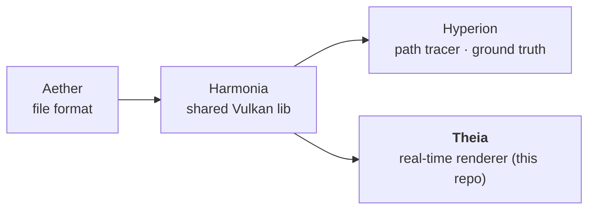
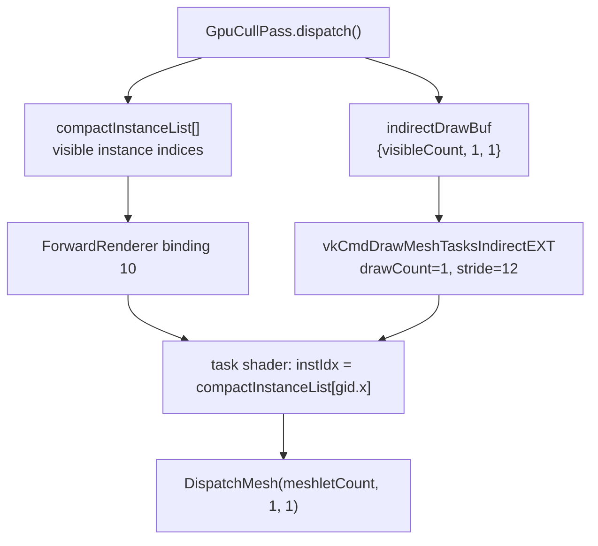

# AGENTS.md — Theia

Quick-start context for AI agents so basic facts don't have to be rediscovered each session.

## What this repo is

**Theia** is the **real-time** renderer: a Vulkan mesh-shader rasterizer (meshlets) being
aligned to match **Hyperion** (the path-traced ground truth). Indirect light (diffuse +
specular + env-NEE) and transmission/refraction are provided by a **HW ray-traced GI pass**
that drives Harmonia's shared `path_integrator` — the single best-quality real-time approach.
Legacy screen-space post effects (SSR/SSAO/bloom/SSGI) were removed from the runtime path;
RT-GI is the only indirect/reflection/occlusion path now.

Pipeline (dependency direction):



Consumes Aether + Harmonia via CMake FetchContent. The demo is a thin `harmonia::App`
subclass injecting `harmonia::IRenderer`. GPU-optimized scene upload / meshlet layouts are
Theia-specific (not in Harmonia).

## Algorithm strategy (drives every technique decision)

- **Best quality, future hardware, ONE approach.** Theia targets future hardware, so pick the
  single best-quality real-time algorithm that matches the Hyperion path-traced ground truth —
  **no cheap fallbacks, no dual-track.** Heavy-but-correct is fine; it scales with hardware.
- **Still almost real-time on current hardware.** The chosen technique must stay near-interactive
  on today's dev machine (bounded work + denoise), not offline brute force. For local testing the
  technique still runs here — just **lower the render resolution** (e.g. the 320x240 parity size)
  rather than swapping in a cheaper algorithm. Resolution is the performance knob; the approach
  never forks.
- **Target hardware (capability, not a brand):** a high-end GPU class with **hardware ray
  tracing**, a **large (~100GB-class) unified memory** pool, and AI-based denoising/upscaling.
  HW ray tracing is first-class and memory is abundant → favor ray-traced techniques;
  low-memory approximations (e.g. WBOIT) have no advantage here. It must also run on **other
  hardware**, so keep the technique single and scale it by resolution (below), not by branching.
- **Transparency/refraction (shipped v0.4.0+):** transmission/refraction is **HW ray-traced**
  via the scene TLAS and runs through Harmonia's shared `path_integrator` — the same estimator
  and OpenPBR BSDF Hyperion uses. Order-independent, refraction-native, best parity. WBOIT and
  the old bespoke `traceTransparentPath` are superseded/removed.

- **GPU-driven, latest standard Vulkan, no vendor extensions.** Prefer GPU-driven rendering
  (indirect/mesh-shader draws, GPU-side culling, bindless) using the latest Vulkan features
  available, but **cross-vendor only** — core + `KHR`/`EXT`. **Never** vendor-specific
  extensions (`VK_NV_*`, `VK_AMD_*`, `VK_INTEL_*`). E.g. ray tracing uses
  `VK_KHR_ray_query` / `VK_KHR_acceleration_structure` (already in use), not a vendor RT path.
  This keeps Theia portable to the "other hardware" requirement above.

## Running

```powershell
build/theia.exe --scene cornell_classic --output out.exr               # headless EXR+PNG
build/theia.exe --scene fixture_ibl                                    # interactive window
```

CLI flags = the common Harmonia set: `--scene/-s`, `--output/-o` (headless EXR+PNG),
`--width`, `--height`, `--validation`/`--no-validation`, `--rt-gi`/`--no-rt-gi` (default on).
**Deprecated/no-op** (legacy postfx removed, kept only for CLI compatibility): `--no-postfx`,
`--indirect-ambient <f>`, `--ssgi-strength <f>`. Theia has no `--spp` (it is not stochastic;
it accumulates frames — see `--offscreen-frames`).

⚠️ No `--offscreen` flag — headless is triggered by `--output`.

## Parity & screenshots: unified RT path

Parity vs Hyperion and showcase screenshots use the same unified RT path. `--no-postfx`
is retained for CLI compatibility and should be treated as a no-op in current Theia builds.

Compare with `Harmonia/tools/compare_renders.py ref.exr cand.exr` (pass = mean_diff <= 4.0,
pre-tonemap EXR, same color space).

## Gotchas (each has cost a debug cycle)

- **Assets come from `build/_deps/aether-src/assets/`** (FetchContent clone), NOT the working
  Aether tree. Editing `C:\Development\GitHub\Aether\assets` does nothing unless you update the
  `_deps` copy or build with `-DFETCHCONTENT_SOURCE_DIR_AETHER=...`. Symptom: two "different"
  renders give byte-identical metrics.
- **IBL parity reference must be high-spp:** scenes using `alignment_16spp_8bounce.render.toml`
  give a 16-spp (noisy) Hyperion reference — render it with `hyperion --spp 512` first, or the
  diff measures noise. (On `alignment_suzanne` this alone inflated mean_diff 9.82 -> 13.56.)
- **Real-time multi-bounce GI now exists (RT-GI):** Theia runs a HW ray-traced GI pass
  (`gi.comp.slang` → shared `path_integrator`) providing path-traced multi-bounce indirect
  (diffuse + specular + env-NEE) and transmission/refraction, default-on (`--no-rt-gi` to
  disable). The old "single-bounce IBL + flat ambient, darker than Hyperion" gap is closed for
  the unified pipeline. The isolated-diffuse `fixture_ibl` passes at 1.76.
- **Bulk subsurface + transmission-scatter run the shared volumetric walk in `gi.comp`:** the
  compute loop executes the same chromatic hero-wavelength free-flight/scatter/boundary
  estimator as Hyperion (`runMediumWalk`), on both primary and secondary vertices. `sampleBSDF`
  sets `entersMedium` with per-channel σ_t exactly like Hyperion; it is NOT a diffuse-tint
  approximation anymore. Thin-walled subsurface keeps the diffuse sheet.
- **IBL specular split-sum is the GI-OFF fallback only:** the prefiltered split-sum map
  (1024x512 / 8-mip, band-limited, can't resolve a sharp HDR sun-disc) is used only on the
  `--no-rt-gi` debug path. The default unified path gets specular reflections from RT-GI.
- **New compute shader entry points** MUST be added to `THEIA_ENTRY_SHADERS` in `CMakeLists.txt`
  or the `.spv` is never compiled and the shader fails to load at runtime ("file not found").
- **GI primary surface = the re-traced closest hit, NOT the rasterized giBuffer materialIdx.**
  The giBuffer is draw-order dependent for overlapping transparent surfaces (depth-write off);
  `gi.comp.slang` trusts the order-independent inline ray query for primary visibility. Do not
  re-add a `materialIdx ==` guard (it caused black holes on overlapping glass; commit 4a04e6e).

## Test scenes

- Quick parity/iteration (cheap): `cornell_classic`, `cornell_spheres`, `cornell_suzanne`,
  `dragon_teapot`, `fixture_ibl`.
- **Never** use `ABeautifulGame` for quick test renders — expensive. (Required only in final
  screenshot/render *deliverable* batches.)

## Build & test

```powershell
cmake -S . -B build -G Ninja -DCMAKE_BUILD_TYPE=Release `
      -DCMAKE_C_COMPILER=clang-cl -DCMAKE_CXX_COMPILER=clang-cl `
      -DCMAKE_TOOLCHAIN_FILE="<vcpkg-root>/scripts/buildsystems/vcpkg.cmake"
cmake --build build
cd build; ctest --output-on-failure
```

SDL3, slangc and volk come from the Vulkan SDK (not vcpkg). vcpkg provides openexr, stb.

## Conventions

- Commit, but do **not** push unless asked.
- Working color space is scene-referred (e.g. `lin_rec2020_scene`).
- **Material model = OpenPBR Surface** (Academy Software Foundation), tagged `model = "openpbr"`.
  OpenPBR's canonical/reference implementation is **MaterialX** (`mx_*` genGLSL nodes); follow
  OpenPBR parameter naming and use MaterialX as the cross-check. Parameters are identical to
  Hyperion — the goal is the best real-time approximation of the same OpenPBR inputs, not
  different parameters. The shared OpenPBR BSDF lives in Harmonia (`bsdf_shared.slang`).

## GPU-driven design (Theia)

**Principle:** GPU-driven by design — all draw submission parameters (dispatch counts, per-draw
instance indices) are GPU-resident and GPU-written. The CPU records commands only; it never reads
back GPU-side state to determine draw counts or parameters.

**Implemented architecture (GD2/GD3):**



- `forward_cull.comp.slang`: 64-thread compute; Gribb-Hartmann 5-plane frustum cull; atomic
  `InterlockedAdd` on `indirectDrawBuf` byte-offset 0 accumulates `groupCountX` = visible count;
  thread 0 restores `groupCountY=1` / `groupCountZ=1` after per-frame `vkCmdFillBuffer` reset.
- Single `VkDrawMeshTasksIndirectCommandEXT` entry `{visibleCount, 1, 1}` — **not** per-instance.
- Task shader indexes `compactInstanceList[gid.x]` (not `SV_DrawID`).
- GD4: Both Hi-Z passes (`cullPhase=1` and `cullPhase=2`) use the same GPU-indirect path;
  per-meshlet Hi-Z occlusion is handled by the mesh shader using `cullPhase` push constant.

**Active extensions for GPU-driven draws:**
- `VK_EXT_mesh_shader`: `vkCmdDrawMeshTasksIndirectEXT` for GPU-count indirect draws ✅
- `VK_EXT_device_generated_commands` (`dgcSupported`): full DGC with per-draw push constants (GD6) ✅ (enabled, not yet wired)

**[Future GD6]** `vkCmdExecuteGeneratedCommandsEXT` (`VK_EXT_device_generated_commands`):
per-draw push constant carries `instanceIdx` from GPU — `compactInstanceList` removed.

**Acceleration structure builds — device-side only (Khronos deprecation compliant):**
- BLAS builds: `vkCmdBuildAccelerationStructuresKHR` (`Geometry::buildBlas`).
- TLAS builds: `vkCmdBuildAccelerationStructuresKHR` (`Scene::buildTlas`).
- `vkBuildAccelerationStructuresKHR` (host-side) is **never used** — deprecated per the
  [Khronos RT AS deprecation blog](https://www.khronos.org/blog/vulkan-ray-tracing-deprecating-host-side-acceleration-structure-builds).
