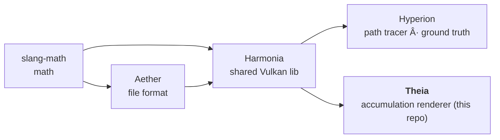
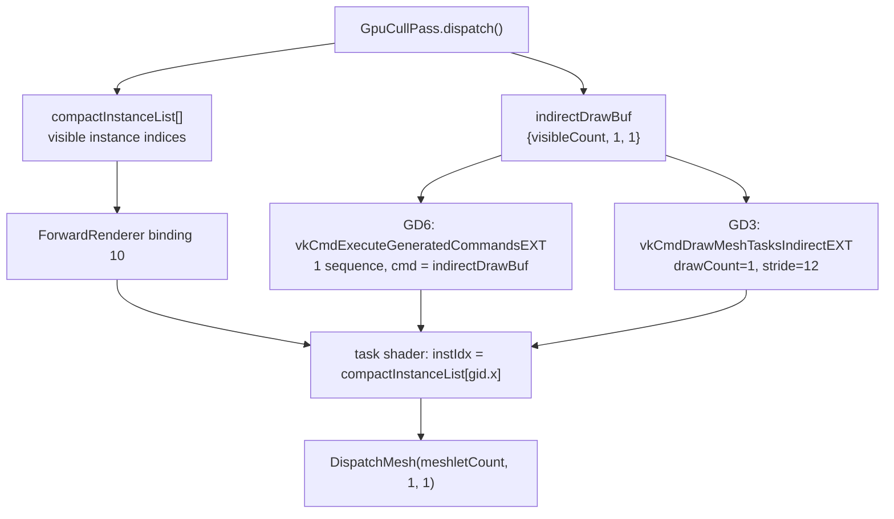

# AGENTS.md — Theia

Quick-start context for AI agents so basic facts don't have to be rediscovered each session.

**Outstanding work, governance (definition of done + guardrails) and release history: see
[`PLAN.md`](PLAN.md).**

## What this repo is

**Theia** is a **lean accumulation path-traced renderer**: a GPU-driven Vulkan renderer that
converges to the **Hyperion** path-traced ground truth through frame accumulation. Multi-bounce
global illumination — diffuse, specular, environment NEE, transmission and refraction — is
**hardware ray-traced** through Harmonia's shared OpenPBR `path_integrator`, the same estimator
and BSDF Hyperion uses. **ReSTIR PT** provides reservoir resampling: a direct-light reservoir
(emissive triangles / env NEE by scene type) plus a **multi-bounce path reservoir** for the
indirect term (GRIS random-replay shift — spatial reuse only, no temporal merge; see gotchas).
An **A-SVGF denoiser** and **TAA** stabilize the image, and progressive accumulation resolves
it to the reference.

Pipeline (dependency direction):



Consumes Aether + Harmonia via CMake FetchContent. The demo is a thin `harmonia::App`
subclass injecting `harmonia::IRenderer`. GPU-optimized scene upload / meshlet layouts are
Theia-specific (not in Harmonia).

## Algorithm strategy (drives every technique decision)

- **One best-quality approach that matches the ground truth.** Theia picks the single
  path-traced estimator that converges to Hyperion — the shared OpenPBR BSDF with environment
  NEE and multi-bounce transport — and scales it with frame accumulation.
- **Scales by resolution and frame count.** Accumulation is the quality/performance knob:
  lower the render resolution or frame count for fast iteration (e.g. the 320x240 parity size),
  raise them for final deliverables. The approach itself stays single.
- **Target hardware (capability, not a brand):** a high-end GPU class with **hardware ray
  tracing**, a **large (~100GB-class) unified memory** pool, and AI-based denoising/upscaling.
  HW ray tracing is first-class and memory is abundant → ray-traced techniques are favored.
  It also runs on **other hardware**, kept portable by scaling resolution and frames.
- **Transparency/refraction (shipped v0.4.0+):** transmission/refraction is **HW ray-traced**
  via the scene TLAS and runs through Harmonia's shared `path_integrator` — the same estimator
  and OpenPBR BSDF Hyperion uses. Order-independent, refraction-native, best parity.

- **GPU-driven, latest standard Vulkan, cross-vendor.** Prefer GPU-driven rendering
  (indirect/mesh-shader draws, GPU-side culling, bindless) using the latest Vulkan features
  available, but **cross-vendor only** — core + `KHR`/`EXT`. **Never** vendor-specific
  extensions (`VK_NV_*`, `VK_AMD_*`, `VK_INTEL_*`). E.g. ray tracing uses
  `VK_KHR_ray_query` / `VK_KHR_acceleration_structure` (already in use), not a vendor RT path.
  This keeps Theia portable to the "other hardware" requirement above.

## Running

```powershell
build/theia.exe --scene cornell_classic --output out.exr               # headless EXR+PNG
build/theia.exe --scene shaderball_base                               # interactive window
```

CLI flags: `--scene/-s`, `--output/-o` (headless EXR+PNG), `--width`, `--height`,
`--offscreen-frames <n>` (accumulation count), `--validation`/`--no-validation`,
`--no-restir-di` (ReSTIR DI off), `--taa`/`--no-taa`, `--no-camera-jitter` (interactive
only — `--output` capture forces jitter ON, see below),
`--indirect-ambient <f>`. RT-GI is always on (it is the renderer — no GI-off path).
Theia accumulates frames — use `--offscreen-frames` for convergence quality.

**Capture is estimator-pure:** `--output` disables every presentation aid — denoiser/TAA,
the firefly clamps, and the A3(a) secondary-bounce roughness regularization — and forces
camera jitter **on**, so the capture integrates the same pixel footprint as Hyperion's
per-sample jitter and converges to the unclamped ground truth. Firefly speckle on HDR
content in a capture is the estimator's true variance, not a bug.

⚠️ No `--offscreen` flag — headless is triggered by `--output`.

**Startup/resize black frames are expected, not a hang:** the window stays black while the
scene uploads and the pipelines build (meshlet processing, BLAS/TLAS builds, RT pipelines —
several seconds on heavy scenes like `ABeautifulGame`), and every window resize
re-initializes the pipeline at the new resolution and restarts accumulation.

## Parity & screenshots: unified RT path

Parity vs Hyperion and showcase screenshots use the unified accumulation RT path.

Compare with `Harmonia/tools/compare_renders.py ref.exr cand.exr` (pre-tonemap EXR, same
color space). The gate is a **strict-AND metric set** (mean_diff ≤ 4.0, rel_mse, SSIM ≥ 0.98,
luminance-histogram corr ≥ 0.999) over the 14 scenes in
`Harmonia/tools/validation_manifest.toml` — full methodology in Harmonia's `AGENTS.md` /
`PLAN.md`.

**Screenshot gallery** (`screenshots/`, 1280×720 PNG): Theia renders 256 frames. The matching
Hyperion screenshots use **64 spp** (fireflies acceptable — 256 spp is too slow for the full
30-scene set); a parity *reference* is distinct and uses a clean Hyperion **256 spp** EXR at
the 320×240 parity resolution.

## Gotchas (each has cost a debug cycle)

- **Assets come from `build/_deps/aether-src/assets/`** (FetchContent clone), NOT the working
  Aether tree. Editing the Aether working tree's `assets/` does nothing unless you update the
  `_deps` copy or build with `-DFETCHCONTENT_SOURCE_DIR_AETHER=...`. Symptom: two "different"
  renders give byte-identical metrics.
- **IBL parity reference must be high-spp:** a low-spp Hyperion reference is noisy — render it
  with `hyperion --spp 256` first, or the diff measures noise, not a real discrepancy.
- **Real-time multi-bounce GI (RT-GI):** Theia runs a HW ray-traced GI pass
  (`gi.comp.slang` → shared `path_integrator`) providing path-traced multi-bounce indirect
  (diffuse + specular + env-NEE) and transmission/refraction. RT-GI is always on — it is the
  renderer's single indirect/reflection/occlusion path (the split-sum IBL fallback was removed).
  The old "single-bounce IBL + flat ambient, darker than Hyperion" gap is closed for the
  unified pipeline.
- **Bulk subsurface + transmission-scatter run the shared volumetric walk in `gi.comp`:** the
  compute loop executes the same chromatic hero-wavelength free-flight/scatter/boundary
  estimator as Hyperion (`runMediumWalk`), on both primary and secondary vertices. `sampleBSDF`
  sets `entersMedium` with per-channel σ_t exactly like Hyperion; it is NOT a diffuse-tint
  approximation anymore. Thin-walled subsurface keeps the diffuse sheet. Pure absorbers
  (single-scatter albedo = 0, e.g. OpenPBR transmission with `transmission_scatter = 0` and
  `transmission_depth > 0`) take the **exact deterministic Beer–Lambert** branch (no free-flight
  sampling, transmittance `exp(-σ_t·d)` applied at the boundary) — matches Hyperion, zero walk
  variance.
- **`GiHit.geoNormal` is the RAW outward-winding normal — never pre-flip it to face the ray.**
  Pre-flipping erases the side bit: `surf.backface = dot(h.geoNormal, wo) < 0` then reads **always
  false** → the C7 dielectric-exit branch never engages (interior exits refract with the entry IOR,
  no TIR), and the medium walk refracts against a wrong-signed normal (broken exits, spurious
  re-entry, repeated Beer–Lambert). Consumers flip a local copy by wo (`makeSurfaceHit`, mirroring
  Hyperion's `shadeSurface`) or use it as the true interface outward normal (`runMediumWalk`
  offsets/Fresnel/refract, backface detection).
- **The path reservoir has NO temporal merge — do not add one back.** A streamed temporal
  merge (yesterday's merged reservoir as today's input) double-counts re-selected history on
  heavy-tailed path candidates: measured −2.8% darker on cornell indirect @1024f, reproduced
  in Monte-Carlo simulation; M-caps don't fix it. Spatial reuse reads neighbours' **unmerged
  local** reservoirs (bindings 20/21 store local candidates only) — plain unbiased RIS, and
  progressive accumulation already integrates the temporal axis. The DI reservoir's temporal
  merge has the same latent bias, invisible on light-tailed direct lighting.
- **New compute shader entry points** MUST be added to `THEIA_ENTRY_SHADERS` in `CMakeLists.txt`
  or the `.spv` is never compiled and the shader fails to load at runtime ("file not found").
- **GI primary surface = the re-traced closest hit, NOT the rasterized giBuffer materialIdx.**
  The giBuffer is draw-order dependent for overlapping transparent surfaces (depth-write off);
  `gi.comp.slang` trusts the order-independent inline ray query for primary visibility. Do not
  re-add a `materialIdx ==` guard (it causes black holes on overlapping glass).

## Test scenes

- Quick parity/iteration (cheap): `cornell_classic`, `cornell_spheres`, `cornell_suzanne`,
  `dragon_teapot`.
- **Never** use `ABeautifulGame` for quick test renders — expensive. (Required only in final
  screenshot/render *deliverable* batches.)

## Build & test

```powershell
cmake -S . -B build -G Ninja -DCMAKE_BUILD_TYPE=Release `
      -DCMAKE_C_COMPILER=clang-cl -DCMAKE_CXX_COMPILER=clang-cl `
      -DCMAKE_TOOLCHAIN_FILE="<vcpkg-root>/scripts/buildsystems/vcpkg.cmake"
cmake --build build
cd build; ctest --output-on-failure
```

Equivalent preset flow (Ninja + Release + clang-cl + `$env:VCPKG_ROOT` toolchain):
`cmake --preset win` / `cmake --build --preset win` / `ctest --preset win`.

**Static analysis:** `python tools/check_tidy.py` — parallel clang-tidy over
`build/compile_commands.json`, classified per `.clang-tidy`'s WarningsAsErrors contract
(clang-diagnostic/clang-analyzer/bugprone fail the run; modernize/performance/portability
are report-only). Also registered as ctest `test_tidy` (label `analysis`; the fast test loop is `ctest -LE analysis`; skips when
clang-tidy, Python3 or the database is missing). Sanitizer lane (Clang/GCC configures only):
`-DTHEIA_SANITIZER=address|undefined|thread`. Host-side FP is deterministic
(`/fp:strict` / `-ffp-contract=off -fno-fast-math`).

SDL3, slangc and volk come from the Vulkan SDK (not vcpkg). vcpkg provides tomlplusplus, OpenImageIO and meshoptimizer.

## Conventions

- Commit, but do **not** push unless asked.
- Working color space is scene-referred (e.g. `lin_rec2020_scene`).
- **Material model = OpenPBR Surface** (Academy Software Foundation), tagged `model = "openpbr"`.
  OpenPBR's canonical/reference implementation is **MaterialX** (`mx_*` genGLSL nodes); follow
  OpenPBR parameter naming and use MaterialX as the cross-check. Parameters are identical to
  Hyperion — the goal is the best real-time approximation of the same OpenPBR inputs, not
  different parameters. The shared OpenPBR BSDF lives in Harmonia (`bsdf_shared.slang`).

## GPU-driven design (Theia)

**Principle:** GPU-driven by design — all draw submission parameters (dispatch counts, per-draw
instance indices) are GPU-resident and GPU-written. The CPU records commands only; it never reads
back GPU-side state to determine draw counts or parameters.

**Implemented architecture (GD2/GD3/GD6):**



**GD6 single GPU-generated draw:** `vkCmdExecuteGeneratedCommandsEXT` issues **one** sequence
whose indirect command is `indirectDrawBuf = {visibleCount, 1, 1}` (GPU-written by the cull
compute). That single draw dispatches `visibleCount` task workgroups, and the task shader indexes
`compactInstanceList[gid.x]` — **identical semantics to the GD3 fallback**, but the command and
its dispatch count stay GPU-resident and are consumed through the modern device-generated-commands
path. Both paths share one task-shader entry point (`gid.x = 0..visibleCount-1`).

> ⚠️ **Do not** use N per-instance DGC sequences keyed on `SV_DrawIndex`: with `maxDrawCount=1`,
> `SV_DrawIndex` is the draw index *within* a sequence (always 0), **not** the sequence index — so
> every sequence would read `compactInstanceList[0]` and only instance 0 (e.g. the floor) would
> rasterize. The single-sequence design (one sequence, `gid.x` indexes the list) avoids this.

- `forward_cull.comp.slang`: 64-thread compute; Gribb-Hartmann 5-plane frustum cull; atomic
  `InterlockedAdd` on `indirectDrawBuf` byte-offset 0 accumulates `groupCountX` = visible count;
  thread 0 restores `groupCountY=1` / `groupCountZ=1` after per-frame `vkCmdFillBuffer` reset.
- `VkIndirectCommandsLayoutEXT`: one `DRAW_MESH_TASKS_EXT` token, stride=12.
- DGC preprocess buffer: sized for `maxSequenceCount=1`, allocated with
  `VK_BUFFER_USAGE_2_PREPROCESS_BUFFER_BIT_EXT` (64-bit flag via `VkBufferUsageFlags2CreateInfo`;
  requires `maintenance5` + `VMA_ALLOCATOR_CREATE_KHR_MAINTENANCE5_BIT`).
- Cull→draw barrier on `indirectDrawBuf` covers both `DRAW_INDIRECT` (GD3) and `COMMAND_PREPROCESS`
  (GD6) destination stages so the GPU-written count is fully visible before it is consumed.
- Two-way dispatch per pass: DGC (preferred) → GD3 indirect (`vkCmdDrawMeshTasksIndirectEXT`).
  The CPU-count direct draw rung was removed — `VK_EXT_mesh_shader` is a hard requirement, so
  the GD3 indirect draw is always available.
- Debug A/B toggles: `THEIA_FORCE_GD3` (skip DGC, use indirect draw), `THEIA_SINGLE_PASS`
  (bypass two-pass Hi-Z), `THEIA_DISABLE_HIZ` (draw all meshlets).
- GD4: Both Hi-Z passes (`cullPhase=1` and `cullPhase=2`) use the same GPU-indirect path;
  per-meshlet Hi-Z occlusion is handled by the mesh shader using `cullPhase` push constant.

**Active extensions for GPU-driven draws:**
- `VK_EXT_mesh_shader`: `vkCmdDrawMeshTasksIndirectEXT` for GPU-count indirect draws ✅
- `VK_EXT_device_generated_commands` (`dgcSupported`): single-sequence GPU-generated mesh draw ✅

**Acceleration structure builds — device-side only (Khronos deprecation compliant):**
- BLAS builds: `vkCmdBuildAccelerationStructuresKHR` (`Geometry::buildBlas`).
- TLAS builds: `vkCmdBuildAccelerationStructuresKHR` (`SceneBase::buildTlas`).
- `vkBuildAccelerationStructuresKHR` (host-side) is **never used** — deprecated per the
  [Khronos RT AS deprecation blog](https://www.khronos.org/blog/vulkan-ray-tracing-deprecating-host-side-acceleration-structure-builds).
