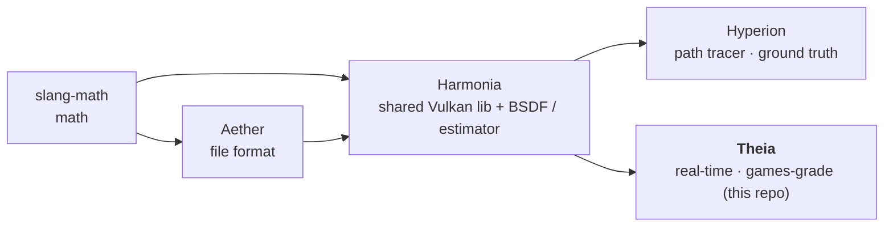

# PLAN — Theia

**Living source of truth for outstanding work.** Shipped items are removed from the work
lists; the shipped record is the *Baseline* below and `git log`. Only outstanding work is
tracked here.

**How to read this plan** — *human / PM:* *How to continue* is the prioritized next-up list.
*AI agent picking up work:* read `AGENTS.md` (orientation, gotchas — especially the
no-temporal-merge rule) → *How to continue* (your task) → *Governance* (definition of done +
guardrails) **before editing**.

## Context

Theia is the **real-time, games-grade tier** of a five-repo rendering pipeline:

The family goal: improve both renderers with the latest industry algorithms, adopting each
technique in the **shared Harmonia estimator + BSDF** wherever both benefit; per-renderer
only where they genuinely diverge. **Theia converges to Hyperion** (the unbiased ground
truth) — the gate is a strict-AND metric set (mean_diff / rel_mse / SSIM /
luminance-histogram) over 14 scenes; methodology and tools live in Harmonia
(`Harmonia/PLAN.md` *Parity methodology*, `Harmonia/tools/`). Most estimator work is owned by
Harmonia; this file tracks what Theia owns or consumes. Sibling plans: `Harmonia/PLAN.md`,
`Hyperion/PLAN.md`, `Aether/PLAN.md`, `slang-math/PLAN.md`.

**Shipped GI state (orientation):** Theia's interactive GI runs **ReSTIR PT** — one unified
reservoir driven by the shared path integrator, which **absorbs DI** (`useRestirDi` is forced
false whenever PT is on, `src/demo/Application.cpp:440` and `:617`; the DI candidate path lives
inside the same reservoir, `GiPass.cpp:776-780`) — plus spatial-only path reuse (see the
no-temporal-merge guardrail) and A-SVGF as an interactive-only presentation stage (identity
for offscreen capture). Stage order is **GI → MotionVector → TAA → Accumulation → Denoiser →
ToneMap** (renderer-side record order in `src/demo/Application.cpp` — GI `:549`/`:621`,
MotionVector `:629`/`:875`, TAA `:632`/`:882`; the shared Accumulation/Denoiser/ToneMap stages
in `Harmonia/src/harmonia/app/App.cpp:302/:313/:337`) — deliberate; do not reorder.

## At a glance

- **Release:** v0.7.8 — lockstep with Harmonia/Hyperion (slang-math v0.2.1, Aether v0.7.4;
  all tag-synced with GitHub).
- **Last shipped (v0.7.8):** **estimator-pure capture** — the extended two-tier contract
  (firefly clamps + A3(a) regularization off, camera jitter forced on for `--output`);
  parity re-baselined with bias removed — see Baseline.
- **Next owned item:** **I6** (configurable frames-per-flip) — below. The shared-estimator
  next-up items (GI-SMS, C9, DN3, LS2, PERF5/PERF4, C11, C12) are owned by
  `Harmonia/PLAN.md` and wire into `gi.comp.slang` when they land.

## How to continue

### Owned items

| ID | Task | Deps | Status |
|----|------|------|--------|
| I6 | **Configurable frames-per-flip** (Theia window): render **N** accumulation frames per one swapchain present (**default N = 1** = current behaviour). N > 1 converges the *displayed* image faster per flip on a static/slow camera (each presented frame is the accumulation of N jittered sub-frames) at the cost of flip rate and input latency; accumulation still resets on camera move (as today). The interactive-window analogue of the headless `--offscreen-frames` path, distinct from TAA (which reprojects+blends rather than pure-accumulates). CLI flag `--frames-per-flip <N>` (default 1); validate against the convergence gate. Self-contained — VK6 present pacing is later polish, not a prerequisite. **Add the flag to the shared parser** (`Harmonia/src/harmonia/app/CliParser.cpp`), not to Theia's silent-swallow arg loop (that loop was the B5 bug — unknown args must hard-error). | — | **next** |
| ANI3 | **Object motion vectors** — extend the MotionVectorPass beyond camera motion to animated instances (per-node velocity → TAA + ReSTIR temporal reuse). The plumbing is already in place but unused: `prevInstanceTransforms` is bound at `shaders/motion_vector.comp.slang:34` while the shader hardcodes the static-scene model (`:76`). | ANI1 (Aether) | backlog |
| MOD4 | **Swapchain recreate on resize → `VK_KHR_swapchain_maintenance1`** — `VkSwapchainPresentScalingCreateInfoEXT` lets the driver scale to extent changes without the full teardown/rebuild in `Swapchain::recreate` (`handleResize`). A behavior decision (render-at-fixed-extent + scale vs current exact-match recreate), so recreate-on-resize is kept for now; the present-pacing half shipped as VK6 (v0.7.6). | — | backlog |
| SM6-Theia | **slang-math v0.3.0 migration slice** — replace hand-rolled sites (`src/theia/scene/Scene.cpp:530` saturate; per-component trig in `src/theia/renderer/CameraController.hpp:36,78` → SM2 functions); bump the FetchContent pin in this repo's release commit. Track origin: slang-math/PLAN.md SM6. | slang-math v0.3.0 tag | backlog |

### ReSTIR-PT refinements (GI-ENH — active)

Owned here (the reservoir lives in `gi.comp.slang`); the estimator half of either item is
shared with Harmonia. Primary source: *ReSTIR PT Enhanced* (Lin, Kettunen, Wyman —
I3D/PACMCGIT 2026, Best Paper, [doi:10.1145/3804494](https://doi.org/10.1145/3804494))
on top of Lin 2022 GRIS:

- **Reconnection shift for the path reservoir, with footprint-based criteria** (GRIS §5 +
  Enhanced §4): replay-only reuse is unbiased but discards path-suffix correlation;
  reconnection (re-route the primary vertex, keep suffix vertices 1+) with the shift Jacobian
  raises reuse quality on glossy surfaces. Reconnect at the first vertex satisfying the dual
  ray-footprint test `min(1/(pˣ_{k−1}·G), 1/(pˣ_k·G_rev)) ≥ (c/100)·R_pri²` (c=0.02,
  `R_pri² = ‖x₀−x₁‖²·⟨n₁,ω₁⟩/(4π)` — scene-scale-independent, replaces scene-tuned
  distance/roughness thresholds) plus the single-vertex roughness guard α_{k−1} ≥ 0.2;
  skip the inverse test when x_k is diffuse/emissive. Needs path-vertex storage in the
  reservoir (~256B stride) — paper-grade.
- **Vector-valued resampling weights** (Enhanced §6.3): accumulate the spatial candidates'
  RGB weights `Σ m_i·F(Y_i)·W_i` for shading instead of the scalar-selected sample's
  `F(Y)·W` — kills chroma noise at zero extra cost (F was already evaluated for p̂).
- **Gaussian paired-neighbor selection** (Enhanced §3): self-inverse offset textures
  (σ=16 ≙ R=30 disk, per-frame flip/mirror/transpose/offset) replace uniform-square draws.
  NB: the paper's 2× spatial-cost win assumes pairwise MIS's two shifts per neighbor; our
  seed-space plain-RIS scheme already pays one, so this is a *quality* change here.
- **Dual motion vectors** (Enhanced §6.4 / Zeng 2021): applies to the A-SVGF/TAA
  reprojection (presentation stages), not to the reservoir.
- **Temporal reuse without recursion bias:** an unbiased temporal form (e.g. GRIS pairwise
  MIS with canonical-sample accounting) could restore temporal memory for the interactive
  (non-accumulated) path, where frame accumulation isn't available. Would also fix the DI
  reservoir's latent recursion bias. **Read the no-temporal-merge guardrail first** — the
  naive streamed merge is prohibited, and this item is the only sanctioned way back in.
  (Enhanced §5's duplication-map→temporal-cCap modulation presupposes a temporal merge and
  is N/A while spatial-only; our per-pass hash dedup (GI2.5) already covers the spatial
  duplicate case.)

### Consumed items (owned elsewhere — pointers)

- **GI-SMS** (caustics/SDS), **DN3** (converging denoiser — the à-trous replacement),
  **DN1** (RaNAD neural denoiser for the low-spp window; unblocked by VK1 cooperative matrix),
  **C11** (ReSTIR SSS — brings Theia's realtime SSS onto the shared random-walk model
  Hyperion already runs → SSS parity), **C9/C12** (BSDF), **PERF5/PERF4** (wavefront — Theia
  is the harder wire: `gi.comp.slang` ~1519 lines fuses ReSTIR PT + medium walk + path trace)
  — all owned by `Harmonia/PLAN.md`.
- **VK4** (subgroup rotate/reconvergence → faster reservoir merging/compaction) and **VK5**
  (pipeline binaries → cuts Theia's cold start: 5 pipelines at init — opaque/transparent/sky/
  cull/GI — and speeds `.spv` hot-reload) — Harmonia owns the probe→enable; Theia consumes.
- **ANI2** (per-frame TLAS refit; needs PERF3), **ANI6** (animated parity gate; needs ANI7),
  **BV4** (wavefront AABB consumers; gated by PERF5) — Harmonia-owned.
- **NH2/NH3** (node hierarchy) once **NH1** (Aether) lands.

## Governance

**Definition of done (per change):** `ctest` green **+** a representative headless render
validation-clean **+** warning-clean build (clang-cl `/W4 /WX /permissive- /Zc:__cplusplus`,
Clang/GNU `-Wall -Wextra -Werror -Wpedantic`; a compiler warning is a build failure — fix the
cause, never silence it; a Vulkan validation message is a bug, never noise). **Per release:**
the above plus `verify-full` (verify + format-check + clang-tidy + cppcheck) **plus** the
parity harness (`Harmonia/tools/render_and_validate.py` over `validation_manifest.toml`)
**plus** `Harmonia/tools/check_vulkan_validation.py` over the full 30-scene gallery **plus**
regenerated screenshots.

**Screenshot standard:** gallery PNGs 1280×720 at **256 frames** accumulation; parity
*references* are a clean Hyperion **256 spp** EXR at the 320×240 parity resolution (never a
low-spp reference).

**Guardrails:**

- **The path reservoir has NO temporal merge — do not add one back** (verbatim rule, also in
  `AGENTS.md`): a streamed temporal merge double-counts re-selected history on heavy-tailed
  path candidates (measured −2.8% darker on cornell indirect @1024f, reproduced in Monte-Carlo
  simulation; M-caps don't fix it). Spatial reuse reads neighbours' **unmerged local**
  reservoirs (bindings 20/21 store local candidates only) — plain unbiased RIS. The only
  sanctioned route back to temporal memory is the unbiased GRIS pairwise-MIS form in
  *ReSTIR-PT refinements* above.
- **The denoiser is a presentation stage, never part of the estimator (v0.7.4 contract):**
  A-SVGF is forced off for offscreen capture (`--output`) in both renderers
  (`Harmonia/src/harmonia/app/App.cpp:372`); a capture is the raw scene-referred estimator
  result. The à-trous kernel has a fixed pixel radius — its effect scales with resolution and
  never vanishes with samples. Do not re-enable it on the capture path, do not describe it as
  converging. (DEN2 makes this a test; DN3 in Harmonia/PLAN.md aims to remove the need for
  the special case.)
- **Capture is estimator-pure (extended contract):** `--output` additionally disables Theia's
  remaining presentation aids — the firefly clamps (`forward_render.frag.slang`,
  `gi.comp.slang`; `fireflyClampEnabled` = rngFlags bit2 / GiPC field) and the A3(a)
  secondary-bounce roughness regularization (`useA3Regularization`) — and forces camera
  jitter **on** (`--no-camera-jitter` is ignored), so the capture integrates the same pixel
  footprint as Hyperion's per-sample jitter and converges to the unclamped ground truth
  (`src/demo/Application.cpp`, `m_pureEstimatorCapture`). The interactive window keeps all
  presentation aids. Consequence: capture renders now show unclamped firefly *variance* on
  HDR content — that is the estimator's true noise floor, not a bug (see
  `Harmonia/PLAN.md` §7 bias-vs-noise method).
- **Convergence-to-Hyperion litmus:** a technique is acceptable on the converging path only
  if its contribution → 0 as samples/frames → ∞, OR it lives in a real-time-only layer
  (denoise, TAA, culling) bypassed in reference/accumulation mode. Irreducible bias is
  rejected from the converging path (presentation-only at most). Neural GI proxies are
  rejected outright (see Harmonia/PLAN.md *Research triage*).
- Shared-BSDF contracts owned by Harmonia apply here verbatim (`Harmonia/PLAN.md`
  guardrails): dielectric sidedness (raw outward `GiHit.geoNormal`), the Chiang 2019
  terminator factor at every NEE/continuation site (Theia-side: `gi.comp.slang:899,1017`,
  `forward_render.frag.slang:302,328`), object-space position-fetch vertices, MaterialX
  transmission-tint semantics, exact Beer–Lambert for pure absorbers, device-only AS builds.
- **Vulkan policy: latest + KHR/EXT, modern over legacy, no fallbacks** (probe→enable pattern
  for optional capabilities; absent-branch must be image-identical and free).
- **Build rules:** clang-cl + Ninja + vcvars; slangc `.slang`→`.spv` with
  `-matrix-layout-row-major`; new Theia compute entries → `THEIA_ENTRY_SHADERS` in
  `CMakeLists.txt`. Force-recompile `.spv` when shared Harmonia shaders change (CMake does not
  track Slang import chains — touch the consuming entry shaders).
- Fix bugs at once — root-caused and patched in the same session. Solve directly, never defer.
- Tags are always pushed to GitHub (verify `git ls-remote --tags origin` == `git tag -l`).
  Release order: slang-math → Aether → Harmonia → **Theia**; bump the Harmonia FetchContent
  pin in the release commit.
- Commit per-repo; push only on explicit OK.
- Living document — done work is removed from this file; the record is the Baseline and
  `git log`.

## Baseline

- **v0.7.8** (current): **estimator-pure capture — the extended two-tier contract.**
  `--output` now disables every presentation aid — A-SVGF/TAA (v0.7.4), the firefly clamps
  (`forward_render.frag.slang` + `gi.comp.slang`; `fireflyClampEnabled` = rngFlags bit2 /
  GiPC field) and the A3(a) secondary-bounce roughness regularization — and forces camera
  jitter ON (`--no-camera-jitter` is ignored), so a capture integrates the same pixel
  footprint as Hyperion's per-sample jitter and converges to the unclamped ground truth
  (`Application.cpp` `m_pureEstimatorCapture`). **Parity re-baselined** (14-scene strict-AND
  @ 320×240 / 256f vs 256 spp): the clamp/jitter bias is gone (global mean ratio —
  cornell_classic 0.97→0.998, openpbr_metals 0.85→0.97); the gate is now variance-dominated
  (residual per-frame grain + HDR firefly speckle) — attacked by GI-ENH variance work
  (*ReSTIR-PT refinements*), never by re-tuning presentation aids. Tooling (presets /
  check_tidy.py + test_tidy / THEIA_SANITIZER / deterministic FP). 18 ctest green;
  30-scene gallery regenerated.
- **v0.7.7**: **C14/VK2 — real OpenPBR `geometry_opacity` cutout.** The
  rasterizer's alpha-test became a stochastic coverage draw (discard with probability 1-α,
  same per-pixel RNG stream as everything else) instead of a fixed cutoff against a dropped,
  non-OpenPBR `geometry_opacity_cutoff` parameter; both the forward shadow ray and the GI
  pass's inline `RayQuery` resolve non-opaque candidates
  (`CandidateType() == CANDIDATE_NON_OPAQUE_TRIANGLE`) — committing fully-present hits,
  accumulating ∏(1-α) otherwise. 17 ctest green; `shaderball_checker` with/without-extension
  image-identical.
- **v0.7.6**: consumed Harmonia's present pacing (VK6: `FIFO_LATEST_READY`, per-present IDs,
  `Swapchain::waitForPresent`) and the other capability adoptions live.
- **v0.7.5**: **B5** (unknown CLI args hard-error), **FB2** (CPU-count dispatch rung removed —
  two-way DGC→GD3 only), **FB3** (`--no-rt-gi` split-sum IBL deleted — RT-GI is the single
  path), **DEN2** (denoiser two-tier output-contract regression test).
- **v0.7.4**: two-tier denoiser output contract (A-SVGF forced off for `--output`).
- **v0.7.3**: R8 Extract Class (Application: EnvImportanceResources, CameraController;
  ForwardRenderer: GpuDrivenState + RenderState + DescriptorState); gallery regenerated.
- **v0.7.2**: Extract Function pass (recordFrame 780L, SceneOutputCopyPass::record 720L,
  createPipeline 567L); GPU-driven GD cleanups.
- **v0.7.1**: **GI2 full PT** — multi-bounce path reservoir for the indirect term (GRIS
  random-replay shift, spatial-only; **no temporal merge by design**). Parity preserved
  (cornell ≈1.9 vs Hyperion 256spp; consistency rate 0.47).
- **Retired interactivity items (I1–I5):** I1 shipped (sky/background pixels reprojected as
  infinitely-distant points in `shaders/motion_vector.comp.slang:51-74`); I2–I5 rested on a
  stage order that does not exist — the shipped order (above) is deliberate, so there is
  nothing left to reorder.
- Earlier history in `git log`.
