# Theia

GPU-driven real-time renderer for OpenPBR materials.

> *[Theia](https://en.wikipedia.org/wiki/Theia_(mythology)) — Titaness of heavenly light, mother of Helios, Selene and Eos.*

Theia is a modern Vulkan 1.4 renderer built on GPU-driven forward rendering techniques.  
It implements the [OpenPBR Surface v1.1](https://academysoftwarefoundation.github.io/OpenPBR/) material model in real-time and targets visual parity with [Hyperion](https://github.com/McNopper/Hyperion)'s path-traced output on identical test scenes. Parity for direct-lighting and IBL-dominated scenes is established; multi-bounce GI parity (closed rooms, indirect-light fill) is work in progress — see *RT-GI* in the roadmap below.

**Interactive real-time rendering** — explore complex materials, dynamic lighting, and HDR output in real-time.  
**Architecture driven by [GPU-Driven Rendering](https://vkguide.dev/docs/gpudriven)** — compute-based culling, indirect dispatch, and clustered lighting.

> **Performance scales with GPU tier.** The mesh-shader pipeline and rendering budget are designed to support HDR output across a range of targets — from 1080p/HDR/30fps on mid-range hardware (e.g. RTX 4050) up to 4K/HDR/60fps on high-end desktop GPUs (RTX 4090/5090 class). Development reference platform: **RTX 4050 at 1080p HDR**.

> ⚠️ **Early stage / work in progress.** Theia is under active development. APIs, rendering
> techniques, and visual output are still evolving, and some features are incomplete or
> approximate. Expect rough edges and breaking changes.

---

## Screenshots

*Same test scenes as [Hyperion](https://github.com/McNopper/Hyperion) — rendered in real-time with visual parity.*

| Cornell Box | Spheres | Suzanne |
|:-----------:|:-------:|:-------:|
| 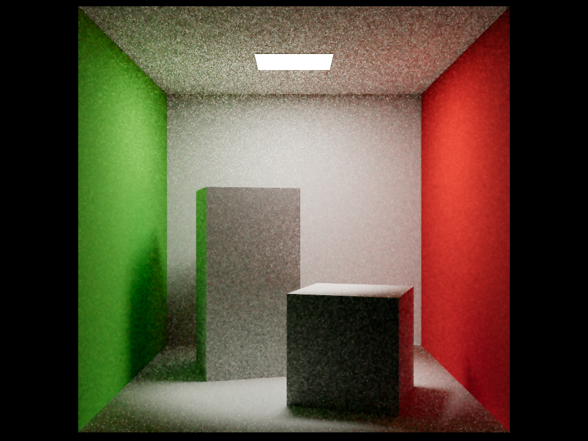 | 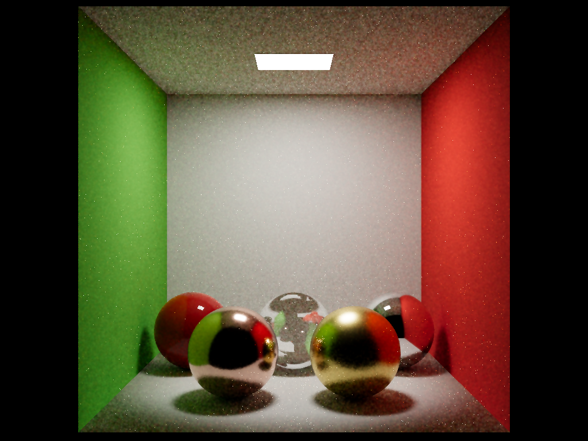 | 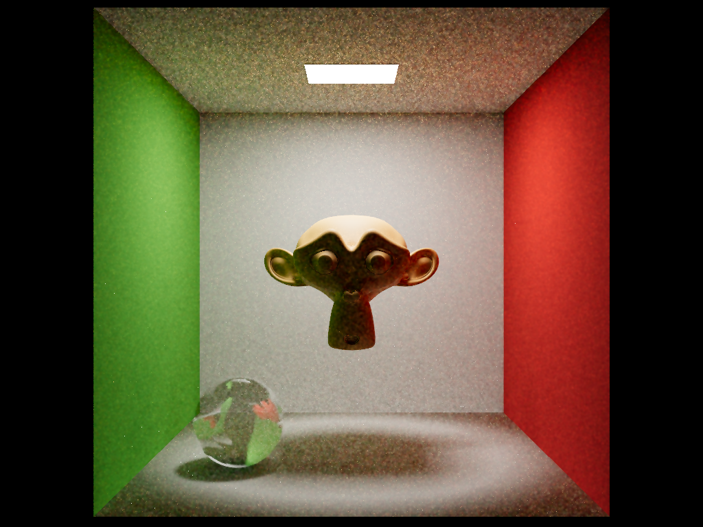 |

| Metals | Dielectrics | Coat |
|:------:|:-----------:|:----:|
| 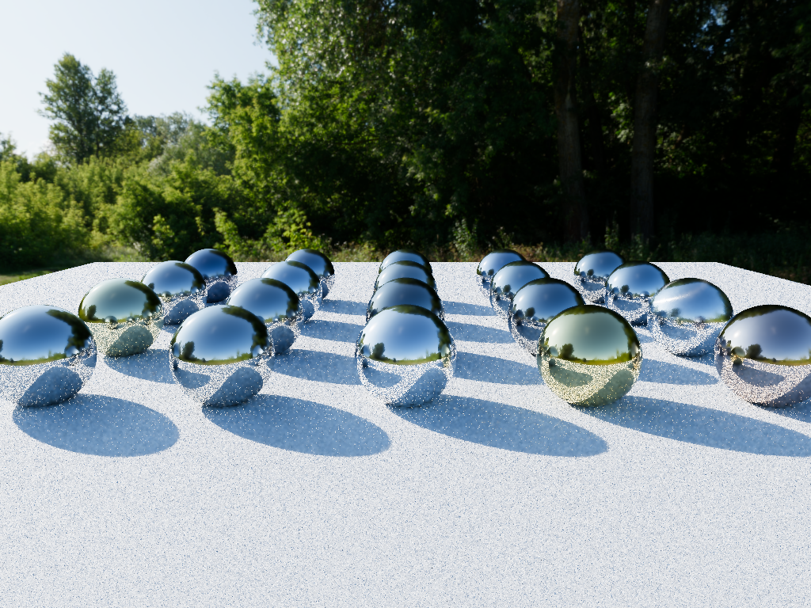 | 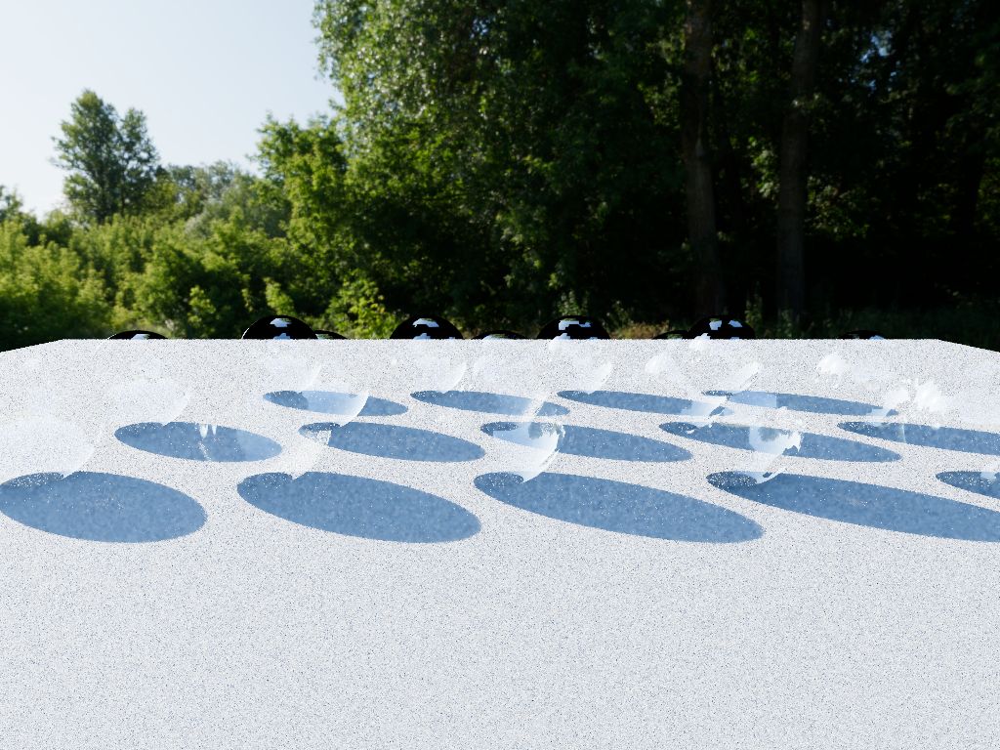 | 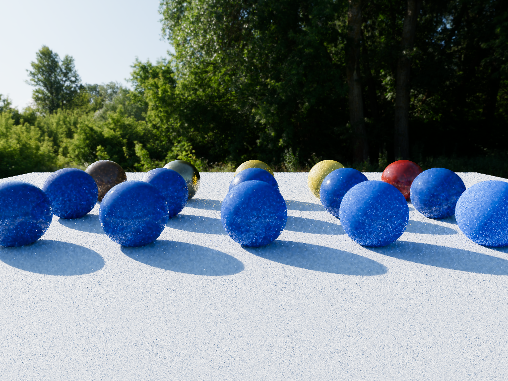 |

| Fuzz | Specular | Organics |
|:----:|:--------:|:--------:|
| 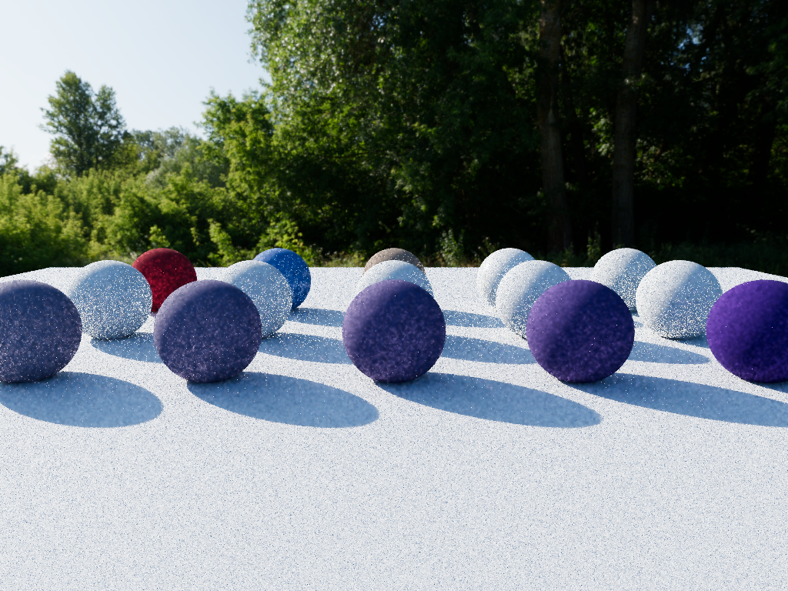 | 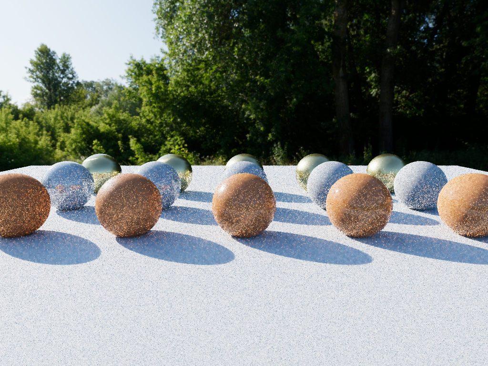 | 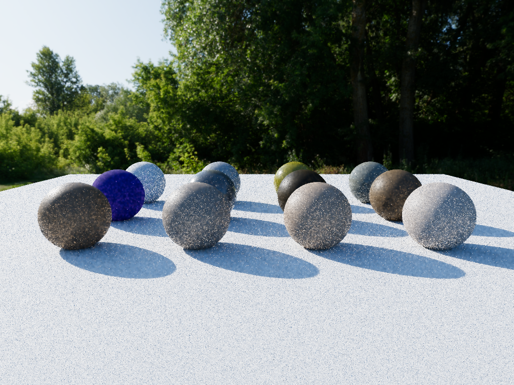 |

| Thin-film | Special Materials | Meadow IBL |
|:---------:|:-----------------:|:----------:|
| 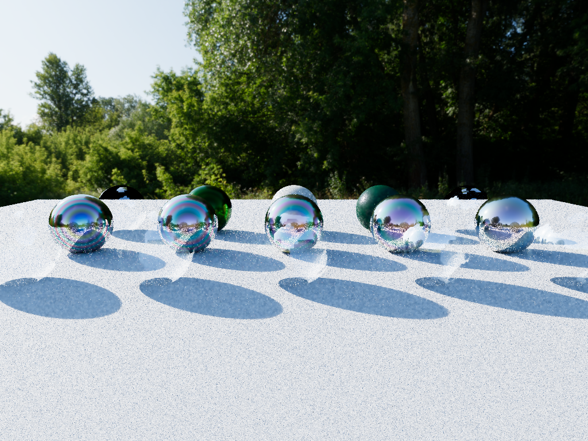 | 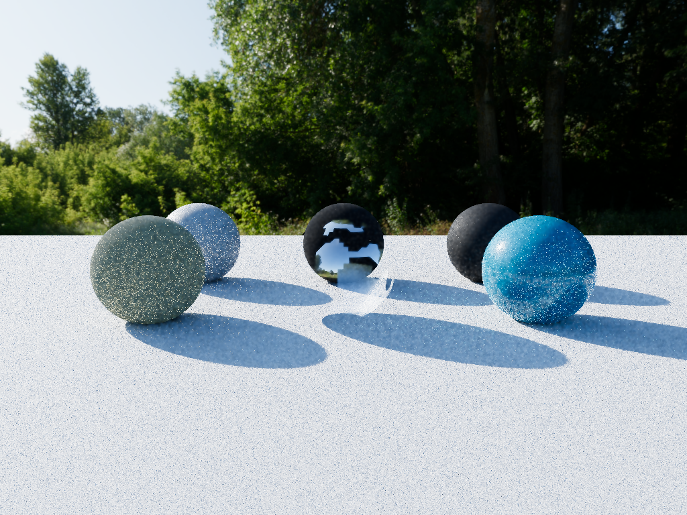 | 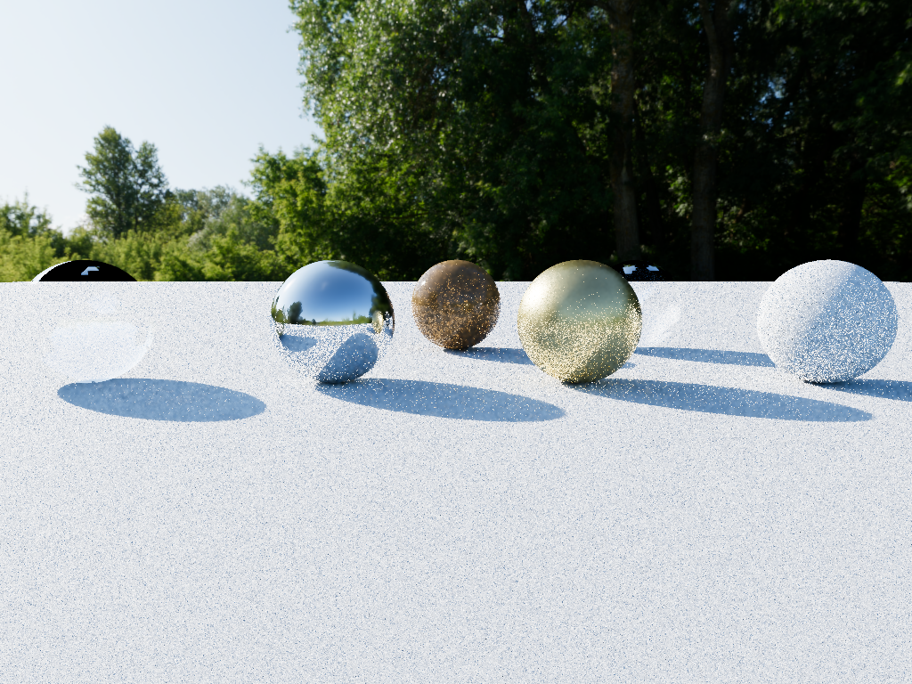 |

| Textured Cube | Dragon & Teapot (IBL) | Advanced Transmission |
|:-------------:|:---------------------:|:---------------------:|
| 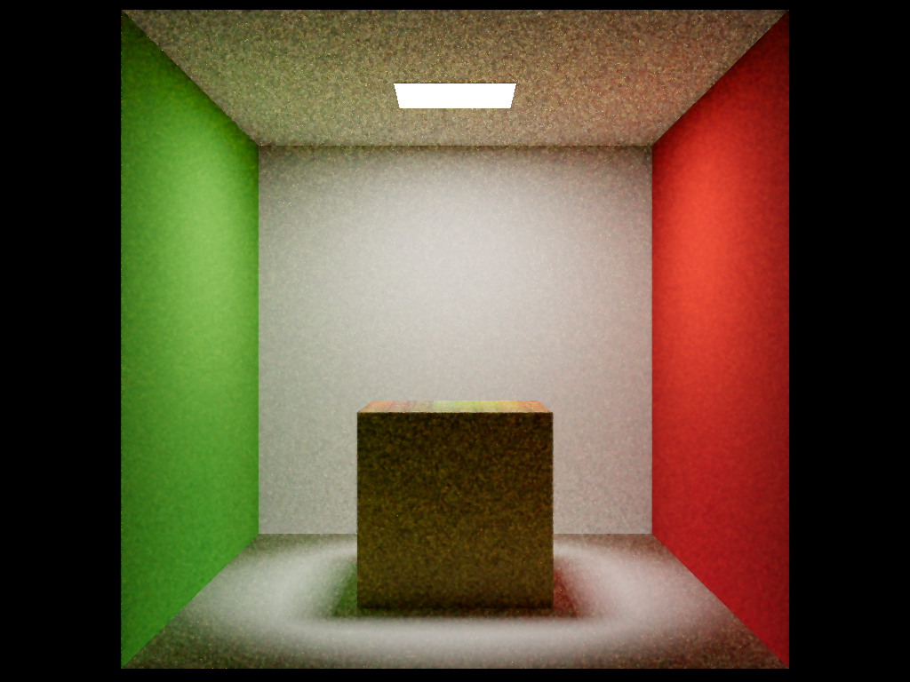 | 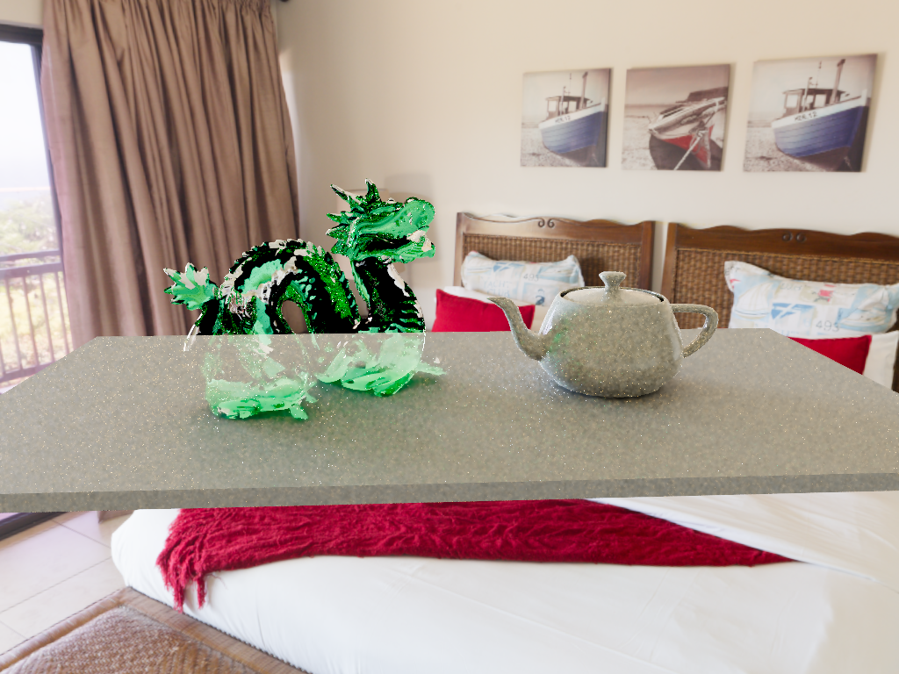 | 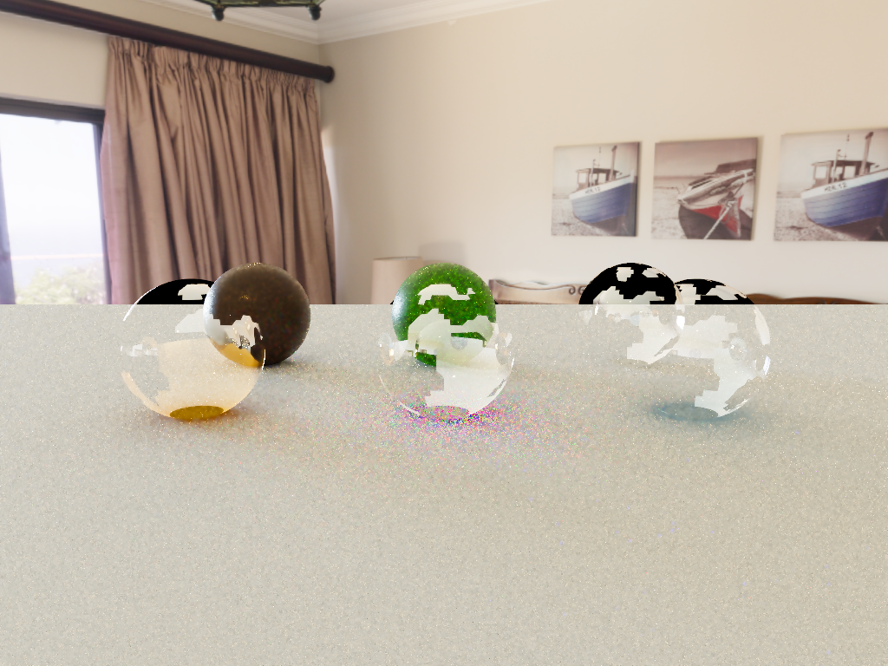 |

| A Beautiful Game (IBL) |
|:----------------------:|
| 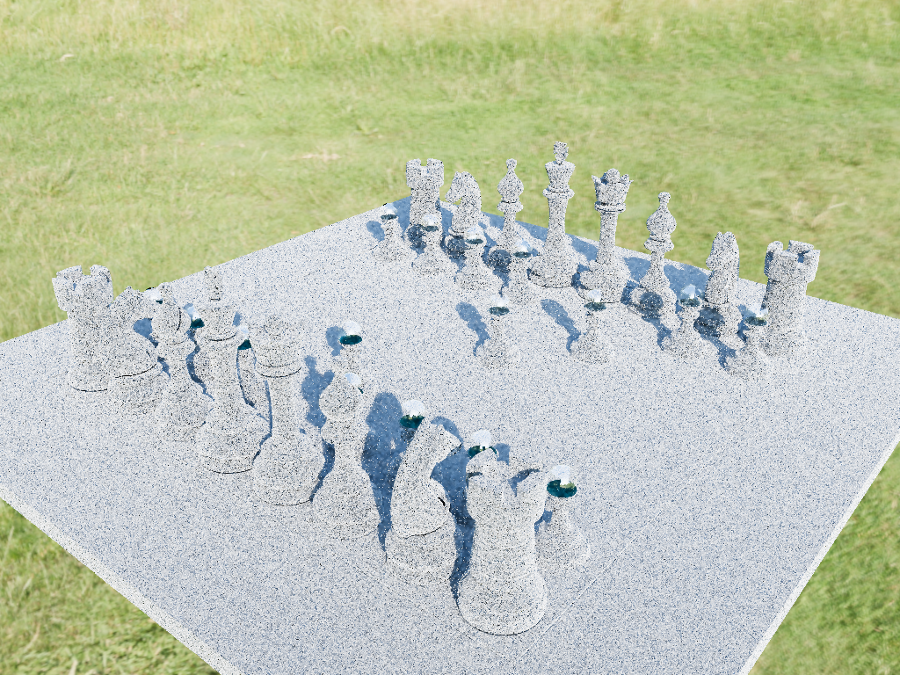 |

---

## Features

### Rendering
- **Vulkan 1.4 dynamic rendering** — `vkCmdBeginRendering` (no render passes; modern efficient rendering)
- **GPU-driven forward rendering** — compute-based culling, indirect command generation, and dispatch
- **Direct lighting** — 1-2 directional lights + Forward+ tile-based point light culling (16×16 px tiles, up to 128 lights/tile)
- **Image-based lighting (IBL)** — equirectangular HDR panorama; diffuse irradiance pre-convolution + per-roughness GGX prefiltered specular map; MaterialX analytic GGX directional albedo (no BRDF LUT)
- **Ray-traced global illumination (RT-GI)** *(planned)* — inline `VK_KHR_ray_query` compute stage; shared unidirectional path-integrator core (NEE + MIS + Russian Roulette) in Harmonia; output feeds the existing accumulation → denoiser chain for convergence to Hyperion ground truth
- **ReSTIR DI + GI** *(planned)* — spatiotemporal reservoir resampling for real-time quality at 1 spp/frame; pure ray-query compute, cross-vendor; converges to the same reference as RT-GI
- **Real-time performance** — GPU-tier dependent: 1080p/HDR/30fps on mid-range (RTX 4050 class); 4K/HDR/60fps on high-end (RTX 4090/5090 class); development reference: RTX 4050 at 1080p HDR
- **Sub-pixel camera jitter (Halton 2,3)** — deterministic raster AA sampling for accumulation-friendly opaque edge anti-aliasing
- **Interactive camera control** — WASD movement, mouse look, EV100 physical exposure adjustment
- **Screen-Space Reflections (SSR)** — linear view-space ray march (64 steps + 8-step binary refinement) with additive composite blend; roughness cutoff 0.45; IBL as fallback for off-screen misses
- **Screen-Space Ambient Occlusion (SSAO)** — hemisphere depth sampling with bilateral blur denoiser; composited into the HDR buffer alongside SSR

### Material model — OpenPBR Surface v1.1
All parameters follow the [OpenPBR spec](https://academysoftwarefoundation.github.io/OpenPBR/) naming. All 8 material layers are fully supported:

| Layer | Parameters | Status |
|-------|-----------|--------|
| Base | `base_weight`, `base_color`, `base_diffuse_roughness`, `base_metalness` | ✅ |
| Specular | `specular_weight`, `specular_color`, `specular_ior`, `specular_roughness`, `specular_roughness_anisotropy` | ✅ |
| Coat | `coat_weight`, `coat_color`, `coat_ior`, `coat_roughness`, `coat_darkening` | ✅ |
| Fuzz | `fuzz_weight`, `fuzz_color`, `fuzz_roughness` | ✅ |
| Emission | `emission_luminance`, `emission_color` | ✅ |
| Thin-film | `thin_film_weight`, `thin_film_thickness`, `thin_film_ior` | ✅ |
| Transmission | `transmission_weight`, `transmission_color`, `transmission_depth` | ✅ |
| Subsurface | `subsurface_weight`, `subsurface_color`, `subsurface_radius`, `subsurface_scale` | ⚠️ screen-space approximation |
| Geometry | `geometry_opacity` | ⚠️ BRDF weight reduction (not alpha-blended transparency) |

Conductor reflectance uses the OpenPBR generalized-Schlick **F82-tint** model (`base_color` = F0, `specular_color` = 82° tint). Specular and coat microfacets use GGX with the spec's anisotropy remapping.

### Color pipeline
- Scene-referred rendering in a selectable **working color space**: linear **Rec.2020**
  (default) or linear **Rec.709**, chosen per scene via `working_color_space` in the
  `[render]` table; assets (material colors, textures, environment maps) are converted
  automatically on load
- Physical camera exposure via **EV100** (`ev100` scene keyword)
- Physical environment scale via **`env_unit_nits`** (cd/m² per EXR unit)
- Tone mapping (shared Harmonia stage): **AgX** (Troy Sobotka), **ACES** RRT+ODT, **Reinhard** luminance, **Hable** / Uncharted-2 filmic
- Display output: **SDR** (sRGB), **HDR10** (PQ/ST2084), **scRGB** — runtime negotiated with swapchain
- Offscreen output: **EXR** is the scene-referred, untonemapped frame; **PNG** is the tonemapped version

**Identical color pipeline to Hyperion** — same algorithms, same visual output (given identical lighting conditions).

### Bindless textures
- Descriptor set 1, binding 4: `COMBINED_IMAGE_SAMPLER` array (up to 1024 entries)
- `NonUniformResourceIndex` for correct divergent access
- Per-material texture maps: `map_base_color`, `map_normal`, `map_orm` (packed occlusion/roughness/metalness), `map_emission_color`

### Scene format
Identical to Hyperion — the TOML-based formats parsed by
[Aether](https://github.com/McNopper/Aether): a `<name>.scene.toml` scene description
with companion `<name>.materials.toml` OpenPBR material libraries (`model = "openpbr"`)
and geometry-only OBJ meshes:

```toml
material_libraries = ["cornell.materials.toml"]

[render]
reference = "presets/preview.render.toml"      # shared preset; inline keys override
working_color_space = "lin_rec2020_scene"      # or "lin_rec709_scene"

[camera]
reference = "presets/cornell.camera.toml"      # translate / look_at / vfov / ev100

[tonemap]
tonemapper = "agx"                             # aces | agx | reinhard | hable

[[geometry]]
type = "instance"                              # instance | box | sphere
mesh = "cornell.obj"
materials = { Floor = "WhiteWall", LeftWall = "RedWall", RightWall = "GreenWall" }
```

OBJ files contribute **only geometry**; all material assignments are declared in the
scene file. See the [Aether README](https://github.com/McNopper/Aether) for the full
format reference.

---

## Architecture

Theia is the **real-time** renderer in a family of four repositories:

| Repository | Role |
|------------|------|
| [Aether](https://github.com/McNopper/Aether) | GPU-agnostic file formats & scene data (`.scene.toml` / `.materials.toml` / OBJ → plain CPU structs); no Vulkan |
| [Harmonia](https://github.com/McNopper/Harmonia) | Shared Vulkan foundation reused **1:1** by both renderers — `harmonia::App` host, core/context, presentation, color management, tonemapping, bindless textures, shared GPU types, Slang shader build |
| [Hyperion](https://github.com/McNopper/Hyperion) | Offline path tracer (ground truth) |
| **Theia** | This repo — real-time GPU-driven forward renderer |

Theia consumes Aether and Harmonia via CMake `FetchContent`. The demo application is a
thin subclass of the shared **`harmonia::App`** host: Harmonia owns the window, swapchain,
HDR target, tonemapping/presentation, IBL probe and scene loading, while Theia injects its
renderer through the `harmonia::IRenderer` seam (Hyperion does the same). Slang shaders
are compiled at build time by Harmonia's shared `compile_slang_shaders` CMake rule
(`shaders/*.slang` → `build/shaders/*.spv`) and loaded through Harmonia's SPIR-V loader.
The **GPU scene layout is renderer-specific**: Theia owns its own `Scene`, `GpuInstance`
and `GpuMeshlet` (`src/theia/scene/`) built around meshlets and the mesh-shader pipeline,
distinct from Hyperion's index-buffer / ray-tracing layout. Only code shared 1:1 lives in
Harmonia.

---

## Building

**Requirements:** Vulkan SDK 1.4, CMake 3.28+, Ninja, clang-cl, vcpkg.

```bash
cmake -S . -B build -G Ninja \
      -DCMAKE_BUILD_TYPE=Release \
      -DCMAKE_C_COMPILER=clang-cl \
      -DCMAKE_CXX_COMPILER=clang-cl \
      -DCMAKE_TOOLCHAIN_FILE="<vcpkg-root>/scripts/buildsystems/vcpkg.cmake"

cmake --build build
```

---

## Running

```bash
# Interactive window (default scene: cornell_classic)
build/theia.exe --scene cornell_classic

# Offscreen render → EXR (scene-referred) + PNG (tonemapped), then exit
build/theia.exe --scene cornell_classic --output out.exr

# Camera controls
# WASD        — move camera
# Right mouse — hold to look around
# Q / E       — move down / up
# [ / ]       — decrease / increase exposure (EV100)
# ESC         — release mouse capture, then quit
```

### Command-line flags

| Flag | Default | Description |
|------|---------|-------------|
| `--scene <name>` / `-s` | `cornell_classic.scene.toml` | Scene name or path; bare names resolve against the assets directory (also accepted as first positional argument) |
| `--output <file>` / `-o` | — | Offscreen mode: render and save EXR (untonemapped) + PNG (tonemapped), then exit |
| `--offscreen-frames <n>` | `4` | Number of frames accumulated/warmed up before offscreen capture is written |
| `--width <n>` | 1920 | Render width in pixels |
| `--height <n>` | 1080 | Render height in pixels |
| `--validation` / `--no-validation` | disabled | Enable / disable Vulkan validation layers |
| `--no-postfx` | off | Disable SSR/SSAO/bloom (required for locked parity comparison renders) |
| `--rt-gi` / `--no-rt-gi` | on | Enable / disable the ray-query GI compute stage (use `--no-rt-gi` for debugging baselines) |
| `--indirect-ambient <x>` | `0.0` | Presentation-only constant indirect ambient boost (scene-linear); keep `0.0` for parity fixtures |
| `--ssgi-strength <x>` | `0.0` | Optional screen-space GI complement; keep `0.0` for parity fixtures |
| `--diag-transparent-env-lod` | off | **Diagnostic-only**: transparent env taps use deterministic roughness/ray-cone LOD (higher mip) instead of mip0 |
| `--no-camera-jitter` | off | Disable sub-pixel camera jitter (debug/baseline comparison only) |

### Indirect lighting and GI architecture

Theia uses a **staged, replaceable pipeline** for indirect lighting:

| Stage | Status | Notes |
|-------|--------|-------|
| Flat ambient (`--indirect-ambient`) | Deprecated | Presentation-only hack; contributes ~0 in closed scenes; will be removed |
| Screen-space GI (`--ssgi-strength`) | Deprecated | Approximation; superseded by RT-GI |
| **RT-GI compute stage** | In progress | `VK_KHR_ray_query` multibounce; shared integrator core with Hyperion; feeds accumulation → denoiser |
| **ReSTIR DI + GI** | Planned | Spatiotemporal reservoir resampling for real-time convergence |

For parity measurements keep `--indirect-ambient 0.0`, `--ssgi-strength 0.0`, and `--no-postfx`. These flags will be retired once RT-GI is the default path.

---

## Tests

> ⚠️ Theia does not have its own test suite yet; correctness is currently validated by
> visual parity against Hyperion (ground truth) on the shared test scenes. The shared
> foundation is covered by the Harmonia and Aether test suites.
>
> **Transparency parity note:** With refreshed Hyperion references (`--spp 512`, `--no-postfx`,
> 320x240), the current baselines are:
> - `fixture_transparency_plane`: `mean_diff 5.901`, `rel_mean 4.249%`, `PSNR 27.56 dB`
> - `fixture_transparency`: `mean_diff 29.252`, `rel_mean 21.277%`, `PSNR 2.09 dB`
>
> Measurement ladder checks (R0-R7) now confirm the transparent composite math and ordering are
> correct; the remaining gap is concentrated in high-energy IBL conditions and is tracked as ongoing
> parity work (Theia bounded RT gather vs Hyperion path-traced reference).
>
> **Gate policy:** keep the strict absolute gate (`mean_diff <= 4.0`) for opaque/direct/SDR fixtures.
> For HDR transmissive fixtures, use `compare_renders.py --gate scale-aware` (absolute OR relative+PSNR),
> which avoids brightness-dependent false fails while still rejecting large structural mismatches.

---

## Dependencies

| Library | Purpose |
|---------|---------|
| [Aether](https://github.com/McNopper/Aether) | Scene & material file formats (`.scene.toml` / `.materials.toml` / OBJ) — GPU-agnostic CPU data |
| [Harmonia](https://github.com/McNopper/Harmonia) | Shared Vulkan foundation (`harmonia::App` host, core, presentation, color, tonemapping, shared GPU types) |
| [Vulkan SDK](https://vulkan.lunarg.com/) | Modern Vulkan 1.4 API |
| [volk](https://github.com/zeux/volk) | Vulkan loader |
| [VMA](https://github.com/GPUOpen-LibrariesAndSDKs/VulkanMemoryAllocator) | GPU memory allocation (via Harmonia) |
| [SDL3](https://libsdl.org/) | Window management & surface |
| [GLM](https://github.com/g-truc/glm) | Mathematics |
| [meshoptimizer](https://github.com/zeux/meshoptimizer) | Meshlet generation and mesh optimization |
| [OpenImageIO](https://openimageio.readthedocs.io/) | Image I/O — PNG/JPEG/EXR load and save (via Harmonia; stb and OpenEXR are transitive dependencies) |
| [Slang](https://shader-slang.com/) | Shader compilation (Slang → SPIR-V) |

---

## References

The following specifications, papers, textbooks, and learning resources informed the design of Theia.  
Where a technique is shared with [Hyperion](https://github.com/McNopper/Hyperion), the same reference applies to both.

### Rendering & GPU-Driven Rendering
| Resource | Relevance |
|----------|-----------|
| [Physically Based Rendering: From Theory To Implementation, 4th ed.](https://www.pbrt.org/) (Pharr, Jakob, Humphreys) | BSDF sampling, Monte Carlo integration, MIS balance heuristic, area light PDF conversion, env-map importance sampling |
| [Real-Time Rendering, 4th ed.](https://www.realtimerendering.com/) (Akenine-Möller et al.) | Real-time algorithms, shadows, BRDF models, IBL, anti-aliasing |
| [Wihlidal — "GPU-Driven Rendering Pipelines" (SIGGRAPH 2015)](https://advances.realtimerendering.com/s2015/aaltonenhaar_siggraph2015_combined_final_footer_220dpi.pdf) | Indirect draw, GPU command generation, per-cluster culling |
| [VK Guide — GPU-Driven Rendering](https://vkguide.dev/docs/gpudriven) | Practical Vulkan indirect dispatch, descriptor binding patterns |
| [Khronos — Mesh Shading for Vulkan](https://www.khronos.org/blog/mesh-shading-for-vulkan) | `VK_EXT_mesh_shader` task/mesh pipeline, `EmitMeshTasksEXT` |
| [Meshoptimizer — Arseny Kapoulkine](https://github.com/zeux/meshoptimizer) | `meshopt_buildMeshlets`, `meshopt_computeMeshletBounds`, cone culling |
| [Heitz, Dupuy, Hill & Neubelt — "Real-Time Polygonal-Light Shading with Linearly Transformed Cosines" (SIGGRAPH 2016)](https://eheitzresearch.wordpress.com/415-2/) | Analytic area-light evaluation reference |
| [McGuire & Mara — "Efficient GPU Screen-Space Ray Tracing" (JCGT 2014)](https://jcgt.org/published/0003/04/04/) | Screen-space reflection depth intersection / ray march |
| [AMD FidelityFX SSSR](https://github.com/GPUOpen-Effects/FidelityFX-SSSR) | SSR reference implementation (MIT) — GGX jitter, denoising, confidence fade |
| [Walter, Marschner, Li & Torrance — "Microfacet Models for Refraction through Rough Surfaces" (EGSR 2007)](https://www.cs.cornell.edu/~srm/publications/EGSR07-btdf.pdf) | GGX (Trowbridge-Reitz) NDF and Smith G2 — foundation of specular evaluation |
| [Heitz — "Sampling the GGX Distribution of Visible Normals" (JCGT 2018)](https://jcgt.org/published/0007/04/01/) | VNDF importance sampling in the IBL pre-filter compute shader |
| [Ray Tracing Gems I & II](https://www.realtimerendering.com/raytracinggems/) (Haines et al., Marrs et al.) | Hybrid rendering, ray query patterns, shadow ray precision |
| [Shirley et al. — "Monte Carlo Techniques for Direct Lighting Calculations" (TOG 1996)](https://dl.acm.org/doi/10.1145/226550.226571) | Emissive-triangle NEE: area sampling, area-to-solid-angle PDF conversion |

### Global Illumination & ReSTIR
| Resource | Relevance |
|----------|-----------|
| [Bitterli, Wyman et al. — "Spatiotemporal Reservoir Resampling for Real-Time Ray Tracing with Dynamic Direct Illumination" (SIGGRAPH 2020)](https://research.nvidia.com/publication/2020-07_spatiotemporal-reservoir-resampling-real-time-ray-tracing-dynamic-direct) | ReSTIR DI: spatiotemporal reservoir resampling for direct illumination |
| [Ouyang, Liu, Lin et al. — "ReSTIR GI: Path Resampling for Real-Time Path Tracing" (HPG 2021)](https://dl.acm.org/doi/10.1145/3451256) | ReSTIR GI: spatiotemporal path resampling for indirect illumination |
| [Lin, Kettunen, Bitterli et al. — "Generalized Resampled Importance Sampling: Foundations of ReSTIR" (SIGGRAPH 2022)](https://research.nvidia.com/publication/2022-07_generalized-resampled-importance-sampling-foundations-restir) | GRIS: unbiased ReSTIR generalization; correctness foundation for RT parity |
| [Wyman, Panteleev — "Rearchitecting Spatiotemporal Resampling for Production" (HPG 2021)](https://research.nvidia.com/publication/2021-07_rearchitecting-spatiotemporal-resampling-production) | ReSTIR DI production implementation and bias-correction techniques |
| [NVIDIA RTXDI SDK](https://github.com/NVIDIAGameWorks/RTXDI) | Open-source ReSTIR DI reference implementation (Apache 2.0) |
| [Heitz, Hill et al. — "Combining Analytic Direct Illumination and Stochastic Shadows" (I3D 2018)](https://research.nvidia.com/publication/2018-05_combining-analytic-direct-illumination-and-stochastic-shadows) | Shadow denoising and analytical/stochastic integration strategies |

### Vulkan & API
| Resource | Relevance |
|----------|-----------|
| [Vulkan Specification 1.4](https://registry.khronos.org/vulkan/specs/latest/html/) | `vkCmdBeginRendering`, mesh shaders, ray queries, descriptor indexing, timeline semaphores |
| [Vulkan Roadmap 2024](https://docs.vulkan.org/spec/latest/appendices/roadmap.html) | Khronos-mandated feature baseline for Theia (no vendor extensions) |
| [Khronos — VK_EXT_mesh_shader Specification](https://registry.khronos.org/vulkan/specs/latest/man/html/VK_EXT_mesh_shader.html) | Task shader payload, `EmitMeshTasksEXT`, output topology |
| [Slang Shading Language](https://shader-slang.com/) | Mesh shader `[outputtopology]`, task payload, `DispatchMesh`, SPIR-V emission |

### Material Model
| Resource | Relevance |
|----------|-----------|
| [OpenPBR Surface Specification v1.1](https://academysoftwarefoundation.github.io/OpenPBR/) | Material layer stack, parameter naming, F82-tint conductor model |
| [MaterialX Standard Surface](https://materialx.org/) | Cross-reference for PBR parameter vocabulary; `mx_ggx_dir_albedo_analytic` for IBL |
| [Blender Principled BSDF](https://docs.blender.org/manual/en/latest/render/shader_nodes/shader/principled.html) | Cross-reference for PBR parameter vocabulary |

### Color Science
| Resource | Relevance |
|----------|-----------|
| [OpenColorIO](https://opencolorio.org/) | Color space transforms, ACES RRT/ODT, tone mapping nomenclature |
| [AgX by Troy Sobotka](https://github.com/sobotka/AgX) | AgX tone-mapping matrices and S-curve (MIT) |
| [ITU-R BT.2100](https://www.itu.int/rec/R-REC-BT.2100/) | PQ/ST2084 and HLG OETF for HDR10 display output |
| [IEC 61966-2-1 (sRGB)](https://www.color.org/srgb.xalter) | sRGB EOTF for SDR display output |

### Scene & Asset Formats
| Resource | Relevance |
|----------|-----------|
| [OpenUSD](https://openusd.org/release/api/index.html) | Naming conventions: Prim, Xform, Mesh, Material, Light, Camera, Instance |
| [glTF 2.0 Specification](https://registry.khronos.org/glTF/specs/2.0/glTF-2.0.html) | PBR material and scene graph conventions |
| [Wavefront OBJ](http://paulbourke.net/dataformats/obj/) | Geometry-only OBJ import (no MTL — materials are assigned in the scene TOML) |
