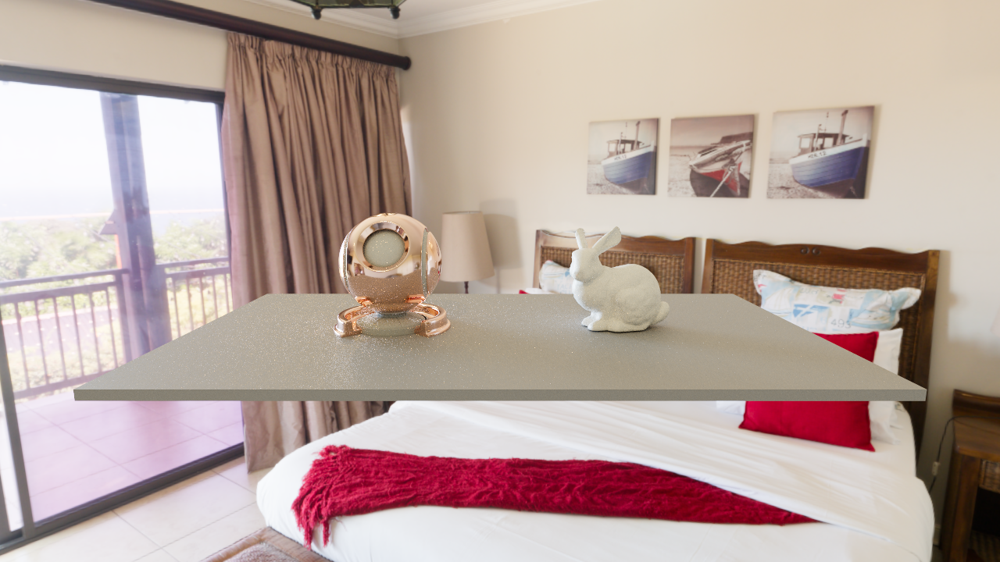
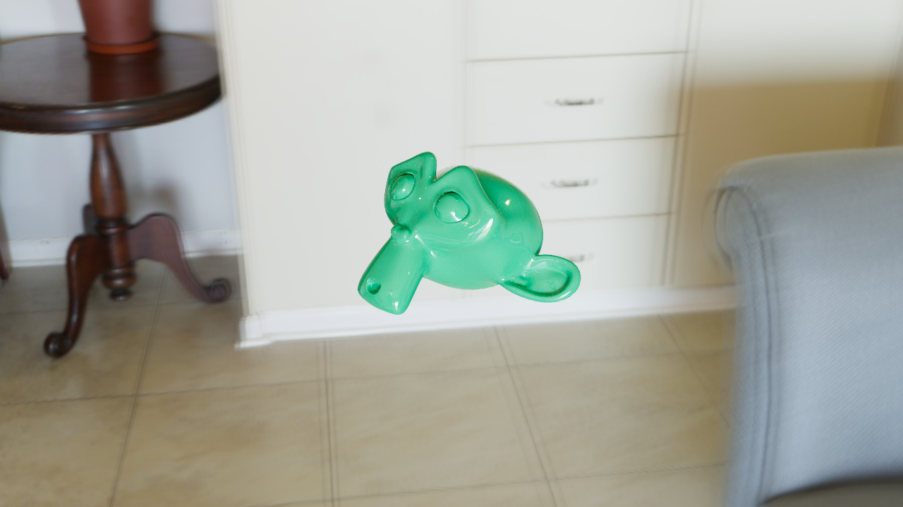
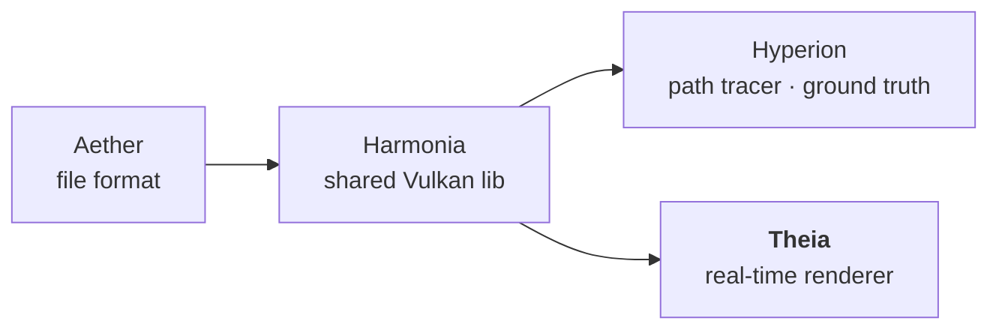

# Theia

GPU-driven real-time renderer for OpenPBR materials.

> *[Theia](https://en.wikipedia.org/wiki/Theia_(mythology)) — Titaness of heavenly light, mother of Helios, Selene and Eos.*

Theia is a modern Vulkan 1.4 renderer built on GPU-driven forward rendering techniques.  
It implements the [OpenPBR Surface v1.1.1](https://academysoftwarefoundation.github.io/OpenPBR/) material model in real-time and targets visual parity with [Hyperion](https://github.com/McNopper/Hyperion)'s path-traced output on identical test scenes. A **unified HW ray-traced GI pass** (sharing Hyperion's `path_integrator`) provides multi-bounce indirect light *and* transmission/refraction, and is the single indirect/reflection/occlusion path. See *Indirect lighting and GI architecture* below.

**Interactive real-time rendering** — explore complex materials, dynamic lighting, and HDR output in real-time.  
**Architecture driven by [GPU-Driven Rendering](https://vkguide.dev/docs/gpudriven)** — compute-based culling, indirect dispatch, and clustered lighting.

---

## Screenshots

*Same test scenes as [Hyperion](https://github.com/McNopper/Hyperion) — rendered in real-time with visual parity.*

| Cornell Box | Spheres | Suzanne |
|:-----------:|:-------:|:-------:|
|  |  |  |

| Metals | Dielectrics | Coat |
|:------:|:-----------:|:----:|
|  |  |  |

| Fuzz | Specular | Organics |
|:----:|:--------:|:--------:|
|  |  |  |

| Thin-film | Special Materials | Meadow IBL |
|:---------:|:-----------------:|:----------:|
|  |  |  |

| Textured Cube | Dragon & Teapot (IBL) | Advanced Transmission |
|:-------------:|:---------------------:|:---------------------:|
|  |  |  |

| A Beautiful Game (IBL) | Bunny + ShaderBall (IBL) | Blender Export |
|:----------------------:|:------------------------:|:------------------------:|
|  |  |  |

---

## Features

### Rendering
- **Vulkan 1.4 dynamic rendering** — `vkCmdBeginRendering` (no render passes; modern efficient rendering)
- **GPU-driven forward rendering with VK_EXT_device_generated_commands (GD6)** — `GpuCullPass` compute shader frustum-culls instances each frame; outputs `compactInstanceList[]` + `indirectDrawBuf{visibleCount,1,1}`; `vkCmdExecuteGeneratedCommandsEXT` issues a single GPU-generated draw whose command is the GPU-written `indirectDrawBuf`, dispatching `visibleCount` task workgroups; task shader uses `compactInstanceList[gid.x]` — shared entry point with the `vkCmdDrawMeshTasksIndirectEXT` (GD3) fallback — CPU records only, no readback
- **Direct lighting** — 1-2 directional lights + Forward+ tile-based point light culling (16×16 px tiles, up to 128 lights/tile)
- **Image-based lighting (IBL)** — equirectangular HDR panorama; diffuse irradiance pre-convolution + per-roughness GGX prefiltered specular map; MaterialX analytic GGX directional albedo (no BRDF LUT)
- **Ray-traced global illumination (RT-GI)** *(enabled by default; disable with `--no-rt-gi`)* — inline `VK_KHR_ray_query` compute stage; shared unidirectional path-integrator core (NEE + MIS + Russian Roulette) in Harmonia; output feeds the accumulation → denoiser chain for convergence to Hyperion ground truth. This is the single indirect/reflection/occlusion path
- **ReSTIR DI** — spatiotemporal reservoir resampling for direct illumination: 8-candidate RIS via power-weighted emissive CDF, temporal reuse (M-cap=20, motion-vector reprojection, normal+depth validation), unbiased W = w_sum/(M·p̂), single shadow ray per pixel; feature-gated (`--no-restir-di`); bias audit: `cornell_classic` mean_diff 2.0 vs Hyperion ground truth
- **Temporal Anti-Aliasing (TAA)** — cross-vendor YCoCg 3×3 neighbourhood AABB clamping + 90/10 history blend; motion-vector reprojection from A1b; `vkCmdCopyImage` ping-pong history; runs after MotionVectorPass, before denoiser; `--no-taa` opt-out
- **Real-time performance** — GPU-tier dependent: 1080p/HDR/30fps on mid-range (RTX 4050 class); 4K/HDR/60fps on high-end (RTX 4090/5090 class); development reference: RTX 4050 at 1080p HDR
- **Sub-pixel camera jitter (Halton 2,3)** — deterministic raster AA sampling for accumulation-friendly opaque edge anti-aliasing
- **Interactive camera control** — WASD movement, mouse look, EV100 physical exposure adjustment

### Material model — OpenPBR Surface v1.1.1
All parameters follow the [OpenPBR spec](https://academysoftwarefoundation.github.io/OpenPBR/) naming. All 8 material layers are fully supported:

| Layer | Parameters | Status |
|-------|-----------|--------|
| Base | `base_weight`, `base_color`, `base_diffuse_roughness`, `base_metalness` | ✅ |
| Specular | `specular_weight`, `specular_color`, `specular_ior`, `specular_roughness`, `specular_roughness_anisotropy` | ✅ |
| Coat | `coat_weight`, `coat_color`, `coat_ior`, `coat_roughness`, `coat_darkening` | ✅ |
| Fuzz | `fuzz_weight`, `fuzz_color`, `fuzz_roughness` | ✅ |
| Emission | `emission_luminance`, `emission_color` | ✅ |
| Thin-film | `thin_film_weight`, `thin_film_thickness`, `thin_film_ior` | ✅ |
| Transmission | `transmission_weight`, `transmission_color`, `transmission_depth` | ✅ |
| Subsurface | `subsurface_weight`, `subsurface_color`, `subsurface_radius`, `subsurface_radius_scale`, `subsurface_scatter_anisotropy` | ✅ real volumetric random walk (shared with Hyperion, run in the RT-GI compute stage) |
| Geometry | `geometry_opacity` | ⚠️ BRDF weight reduction (not alpha-blended transparency) |

Conductor reflectance uses the OpenPBR generalized-Schlick **F82-tint** model (`base_color` = F0, `specular_color` = 82° tint). Specular and coat microfacets use GGX with the spec's anisotropy remapping plus Turquin/Kulla-Conty multiple-scattering compensation.

**Thin-film iridescence** uses the spec model — a faithful port of MaterialX `mx_fresnel_airy` (Belcour & Barla 2017): a full s/p-polarized Airy summation with the spectral Gaussian sensitivity. Metals use the true **complex-IOR conductor phase** (`(n,k)` recovered from `base_color` + `specular_color` via Gulbrandsen 2014), so anodized metals show vivid, physically-correct interference colour, blended with the dielectric Schlick interface by `base_metalness`. The shared BSDF lives in Harmonia, so this renders **identically to Hyperion**.

**Fuzz/sheen** is the OpenPBR spec model — a faithful port of MaterialX's Zeltner et al. 2022 "Practical Multiple-Scattering Sheen Using Linearly Transformed Cosines" (analytic LTC + directional-albedo fits, no lookup table). The sheen directional albedo also drives the physically-correct, view-dependent darkening of the layers beneath the fuzz. Shared Harmonia BSDF → **identical to Hyperion**.

**Subsurface** (bulk, non-thin-walled) runs the **same chromatic volumetric random walk as Hyperion** — routed through the unified RT-GI compute stage (`gi.comp` executes the shared hero-wavelength free-flight/scatter/boundary estimator on both primary and secondary vertices). Light refracts through the dielectric interface (Fresnel-gated), takes Henyey-Greenstein scattering steps with per-channel extinction derived from `subsurface_radius` × `subsurface_radius_scale` (single-scatter albedo = `subsurface_color`), and exits through the interface. Thin-walled subsurface keeps the diffuse-sheet approximation. **Transmission scattering** (`transmission_scatter`) reuses the same walk, so both match Hyperion's transport model, not just its parameters.

### Color pipeline
- Scene-referred rendering in a selectable **working color space**: linear **Rec.2020**
  (default) or linear **Rec.709**, chosen per scene via `working_color_space` in the
  `[render]` table; assets (material colors, textures, environment maps) are converted
  automatically on load
- Physical camera exposure via **EV100** (`ev100` scene keyword)
- Physical environment scale via **`env_unit_nits`** (cd/m² per EXR unit)
- Tone mapping (shared Harmonia stage): **AgX** (Troy Sobotka), **ACES** RRT+ODT, **Reinhard** luminance, **Hable** / Uncharted-2 filmic
- Display output: **SDR** (sRGB), **HDR10** (PQ/ST2084), **scRGB** — runtime negotiated with swapchain
- Offscreen output: **EXR** is the scene-referred, untonemapped frame; **PNG** is tone-mapped through the **same GPU ToneMapper stage the interactive window uses** (the scene's configured operator — AgX/ACES/Reinhard/Hable — into an 8-bit sRGB target), so screenshots match the live view

**Identical color pipeline to Hyperion** — same algorithms, same visual output (given identical lighting conditions).

### Bindless textures
- Descriptor set 1, binding 4: `COMBINED_IMAGE_SAMPLER` array (up to 1024 entries)
- `NonUniformResourceIndex` for correct divergent access
- Per-material texture maps: `map_base_color`, `map_normal`, `map_orm` (packed occlusion/roughness/metalness), `map_emission_color`

### Scene format
Identical to Hyperion — the TOML-based formats parsed by
[Aether](https://github.com/McNopper/Aether): a `<name>.scene.toml` scene description
with companion `<name>.materials.toml` OpenPBR material libraries (`model = "openpbr"`)
and geometry-only OBJ meshes:

```toml
material_libraries = ["cornell.materials.toml"]

[render]
reference = "presets/preview.render.toml"      # shared preset; inline keys override
working_color_space = "lin_rec2020_scene"      # or "lin_rec709_scene"

[camera]
reference = "presets/cornell.camera.toml"      # translate / look_at / vfov / ev100

[tonemap]
tonemapper = "agx"                             # aces | agx | reinhard | hable

[[geometry]]
type = "instance"                              # instance | box | sphere
mesh = "cornell.obj"
materials = { Floor = "WhiteWall", LeftWall = "RedWall", RightWall = "GreenWall" }
```

OBJ files contribute **only geometry**; all material assignments are declared in the
scene file. See the [Aether README](https://github.com/McNopper/Aether) for the full
format reference.

---

## Architecture

Theia is the **real-time** renderer in a family of four repositories:



| Repository | Role |
|------------|------|
| [Aether](https://github.com/McNopper/Aether) | GPU-agnostic file formats & scene data (`.scene.toml` / `.materials.toml` / OBJ → plain CPU structs); no Vulkan |
| [Harmonia](https://github.com/McNopper/Harmonia) | Shared Vulkan foundation reused **1:1** by both renderers — `harmonia::App` host, core/context, presentation, color management, tonemapping, bindless textures, shared GPU types, Slang shader build |
| [Hyperion](https://github.com/McNopper/Hyperion) | Offline path tracer (ground truth) |
| **Theia** | This repo — real-time GPU-driven forward renderer |

Theia consumes Aether and Harmonia via CMake `FetchContent`. The demo application is a
thin subclass of the shared **`harmonia::App`** host: Harmonia owns the window, swapchain,
HDR target, tonemapping/presentation, IBL probe and scene loading, while Theia injects its
renderer through the `harmonia::IRenderer` seam (Hyperion does the same). Slang shaders
are compiled at build time by Harmonia's shared `compile_slang_shaders` CMake rule
(`shaders/*.slang` → `build/shaders/*.spv`) and loaded through Harmonia's SPIR-V loader.
The **GPU scene layout is renderer-specific**: Theia owns its own `Scene`, `GpuInstance`
and `GpuMeshlet` (`src/theia/scene/`) built around meshlets and the mesh-shader pipeline,
distinct from Hyperion's index-buffer / ray-tracing layout. Only code shared 1:1 lives in
Harmonia.

---

## Building

**Requirements:** Vulkan SDK 1.4, CMake 3.28+, Ninja, clang-cl, vcpkg.

```bash
cmake -S . -B build -G Ninja \
      -DCMAKE_BUILD_TYPE=Release \
      -DCMAKE_C_COMPILER=clang-cl \
      -DCMAKE_CXX_COMPILER=clang-cl \
      -DCMAKE_TOOLCHAIN_FILE="<vcpkg-root>/scripts/buildsystems/vcpkg.cmake"

cmake --build build
```

---

## Running

```bash
# Interactive window (default scene: cornell_classic)
build/theia.exe --scene cornell_classic

# Offscreen render → EXR (scene-referred) + PNG (tonemapped), then exit
build/theia.exe --scene cornell_classic --output out.exr

# Camera controls
# WASD        — move camera
# Right mouse — hold to look around
# Q / E       — move down / up
# [ / ]       — decrease / increase exposure (EV100)
# ESC         — release mouse capture, then quit
```

### Command-line flags

| Flag | Default | Description |
|------|---------|-------------|
| `--scene <name>` / `-s` | `cornell_classic.scene.toml` | Scene name or path; bare names resolve against the assets directory (also accepted as first positional argument) |
| `--output <file>` / `-o` | — | Offscreen mode: render and save EXR (untonemapped) + PNG (tonemapped), then exit |
| `--offscreen-frames <n>` | `4` | Number of frames accumulated/warmed up before offscreen capture is written |
| `--width <n>` | 1024 | Render width in pixels |
| `--height <n>` | 768 | Render height in pixels |
| `--validation` / `--no-validation` | disabled | Enable / disable Vulkan validation layers |
| `--taa` / `--no-taa` | on | Interactive-window temporal anti-aliasing during camera motion. `--taa` is **incompatible with `--output`** (offscreen uses progressive accumulation); the two must not be combined |
| `--no-restir-di` | off (ReSTIR DI on) | Disable ReSTIR direct-light importance resampling (debug/baseline) |
| `--no-postfx` | off | No-op, accepted for CLI compatibility |
| `--rt-gi` / `--no-rt-gi` | on | Enable / disable the ray-query GI compute stage (use `--no-rt-gi` for debugging baselines) |
| `--indirect-ambient <x>` | `0.0` | No-op, accepted for CLI compatibility |
| `--ssgi-strength <x>` | `0.0` | No-op, accepted for CLI compatibility |
| `--no-camera-jitter` | off | Disable sub-pixel camera jitter (debug/baseline comparison only) |

### Indirect lighting and GI architecture

Theia uses a **staged, replaceable pipeline** for indirect lighting:

| Stage | Status | Notes |
|-------|--------|-------|
| **RT-GI compute stage** | Default-on | `VK_KHR_ray_query` multibounce; shared integrator core with Hyperion; also drives transmission/refraction; feeds accumulation → denoiser. The single indirect/reflection/occlusion path. Disable with `--no-rt-gi` for debugging baselines |
| Split-sum `evalIBL` | Fallback | First-hit IBL used only on the `--no-rt-gi` debug path |
| **ReSTIR DI + GI** | Planned | Spatiotemporal reservoir resampling for real-time convergence |

RT-GI is the single unified indirect + transmission provider and drives both the parity and interactive paths.

---

## Tests

> Theia has a module test suite (`ctest`) covering its renderer-specific logic; the shared
> BSDF/estimator/pipeline foundation is covered by the Harmonia and Aether test suites. End-to-end
> material correctness is validated by visual parity against Hyperion (ground truth) on the shared
> test scenes.
>
> **Transparency parity note:** Transparent surfaces route through the **shared Harmonia
> `path_integrator`** (smooth-dielectric delta refraction lobe + Beer-Lambert + env-NEE) — the same
> estimator Hyperion uses. Residuals are localized high-energy-IBL-through-glass variance and a
> minor TIR notch.
>
> **Gate policy:** keep the strict absolute gate (`mean_diff <= 4.0`) for opaque/direct/SDR fixtures.
> For HDR transmissive fixtures, use `compare_renders.py --gate scale-aware` (absolute OR relative+PSNR),
> which avoids brightness-dependent false fails while still rejecting large structural mismatches.

---

## Dependencies

| Library | Purpose |
|---------|---------|
| [Aether](https://github.com/McNopper/Aether) | Scene & material file formats (`.scene.toml` / `.materials.toml` / OBJ) — GPU-agnostic CPU data |
| [Harmonia](https://github.com/McNopper/Harmonia) | Shared Vulkan foundation (`harmonia::App` host, core, presentation, color, tonemapping, shared GPU types) |
| [Vulkan SDK](https://vulkan.lunarg.com/) | Modern Vulkan 1.4 API |
| [volk](https://github.com/zeux/volk) | Vulkan loader |
| [VMA](https://github.com/GPUOpen-LibrariesAndSDKs/VulkanMemoryAllocator) | GPU memory allocation (via Harmonia) |
| [SDL3](https://libsdl.org/) | Window management & surface |
| [slang-math](https://github.com/McNopper/slang-math) | Mathematics — via Harmonia (transitive FetchContent) |
| [meshoptimizer](https://github.com/zeux/meshoptimizer) | Meshlet generation and mesh optimization |
| [OpenImageIO](https://openimageio.readthedocs.io/) | Image I/O — PNG/JPEG/EXR load and save (via Harmonia; stb and OpenEXR are transitive dependencies) |
| [Slang](https://shader-slang.com/) | Shader compilation (Slang → SPIR-V) |

---

## References

The following specifications, papers, textbooks, and learning resources informed the design of Theia.  
Where a technique is shared with [Hyperion](https://github.com/McNopper/Hyperion), the same reference applies to both.

### Rendering & GPU-Driven Rendering
| Resource | Relevance |
|----------|-----------|
| [Physically Based Rendering: From Theory To Implementation, 4th ed.](https://www.pbrt.org/) (Pharr, Jakob, Humphreys) | BSDF sampling, Monte Carlo integration, MIS balance heuristic, area light PDF conversion, env-map importance sampling |
| [Real-Time Rendering, 4th ed.](https://www.realtimerendering.com/) (Akenine-Möller et al.) | Real-time algorithms, shadows, BRDF models, IBL, anti-aliasing |
| [Wihlidal — "GPU-Driven Rendering Pipelines" (SIGGRAPH 2015)](https://advances.realtimerendering.com/s2015/aaltonenhaar_siggraph2015_combined_final_footer_220dpi.pdf) | Indirect draw, GPU command generation, per-cluster culling |
| [VK Guide — GPU-Driven Rendering](https://vkguide.dev/docs/gpudriven) | Practical Vulkan indirect dispatch, descriptor binding patterns |
| [Khronos — Mesh Shading for Vulkan](https://www.khronos.org/blog/mesh-shading-for-vulkan) | `VK_EXT_mesh_shader` task/mesh pipeline, `EmitMeshTasksEXT` |
| [Meshoptimizer — Arseny Kapoulkine](https://github.com/zeux/meshoptimizer) | `meshopt_buildMeshlets`, `meshopt_computeMeshletBounds`, cone culling |
| [Heitz, Dupuy, Hill & Neubelt — "Real-Time Polygonal-Light Shading with Linearly Transformed Cosines" (SIGGRAPH 2016)](https://eheitzresearch.wordpress.com/415-2/) | Analytic area-light evaluation reference |
| [Walter, Marschner, Li & Torrance — "Microfacet Models for Refraction through Rough Surfaces" (EGSR 2007)](https://www.cs.cornell.edu/~srm/publications/EGSR07-btdf.pdf) | GGX (Trowbridge-Reitz) NDF and Smith G2 — foundation of specular evaluation |
| [Heitz — "Sampling the GGX Distribution of Visible Normals" (JCGT 2018)](https://jcgt.org/published/0007/04/01/) | VNDF importance sampling in the IBL pre-filter compute shader |
| [Ray Tracing Gems I & II](https://www.realtimerendering.com/raytracinggems/) (Haines et al., Marrs et al.) | Hybrid rendering, ray query patterns, shadow ray precision |
| [Shirley et al. — "Monte Carlo Techniques for Direct Lighting Calculations" (TOG 1996)](https://dl.acm.org/doi/10.1145/226550.226571) | Emissive-triangle NEE: area sampling, area-to-solid-angle PDF conversion |

### Vulkan & API
| Resource | Relevance |
|----------|-----------|
| [Vulkan Specification 1.4](https://registry.khronos.org/vulkan/specs/latest/html/) | `vkCmdBeginRendering`, mesh shaders, ray queries, descriptor indexing, timeline semaphores |
| [Vulkan Roadmap 2024](https://docs.vulkan.org/spec/latest/appendices/roadmap.html) | Khronos-mandated feature baseline for Theia (no vendor extensions) |
| [Khronos — VK_EXT_mesh_shader Specification](https://registry.khronos.org/vulkan/specs/latest/man/html/VK_EXT_mesh_shader.html) | Task shader payload, `EmitMeshTasksEXT`, output topology |
| [Slang Shading Language](https://shader-slang.com/) | Mesh shader `[outputtopology]`, task payload, `DispatchMesh`, SPIR-V emission |

### Material Model
| Resource | Relevance |
|----------|-----------|
| [OpenPBR Surface Specification v1.1.1](https://academysoftwarefoundation.github.io/OpenPBR/) | Material layer stack, parameter naming, F82-tint conductor model |
| [MaterialX Standard Surface](https://materialx.org/) | Cross-reference for PBR parameter vocabulary; `mx_ggx_dir_albedo_analytic` for IBL |
| [Blender Principled BSDF](https://docs.blender.org/manual/en/latest/render/shader_nodes/shader/principled.html) | Cross-reference for PBR parameter vocabulary |
| [Henyey & Greenstein — "Diffuse Radiation in the Galaxy" (1941)](https://articles.adsabs.harvard.edu/pdf/1941ApJ....93...70H) | Henyey-Greenstein phase function for the subsurface / transmission volumetric random walk (RT-GI compute stage) |
| [Wilkie et al. — "Hero Wavelength Spectral Sampling" (EGSR 2014)](https://cgg.mff.cuni.cz/~wilkie/Website/EGSR_14_files/WNDWH14.pdf) | Hero-wavelength spectral-MIS estimator for chromatic (per-channel) subsurface / transmission media |
| [Novák et al. — "Monte Carlo Methods for Volumetric Light Transport Simulation" (Eurographics STAR 2018)](https://cs.dartmouth.edu/~wjarosz/publications/novak18monte.html) | Free-flight distance sampling, collision estimators, and transmittance for the medium walk |
| [Harmonia README — Surface BSDF references](https://github.com/McNopper/Harmonia#references) | Full citations for the shared BSDF closures (thin-film, sheen/LTC, MS-comp, conductor Fresnel) implemented in `bsdf_shared.slang` |

### Color Science
| Resource | Relevance |
|----------|-----------|
| [OpenColorIO](https://opencolorio.org/) | Color space transforms, ACES RRT/ODT, tone mapping nomenclature |
| [AgX by Troy Sobotka](https://github.com/sobotka/AgX) | AgX tone-mapping matrices and S-curve (MIT) |
| [ITU-R BT.2100](https://www.itu.int/rec/R-REC-BT.2100/) | PQ/ST2084 and HLG OETF for HDR10 display output |
| [IEC 61966-2-1 (sRGB)](https://www.color.org/srgb.xalter) | sRGB EOTF for SDR display output |

### Scene & Asset Formats
| Resource | Relevance |
|----------|-----------|
| [OpenUSD](https://openusd.org/release/api/index.html) | Naming conventions: Prim, Xform, Mesh, Material, Light, Camera, Instance |
| [glTF 2.0 Specification](https://registry.khronos.org/glTF/specs/2.0/glTF-2.0.html) | PBR material and scene graph conventions |
| [Wavefront OBJ](http://paulbourke.net/dataformats/obj/) | Geometry-only OBJ import (no MTL — materials are assigned in the scene TOML) |
